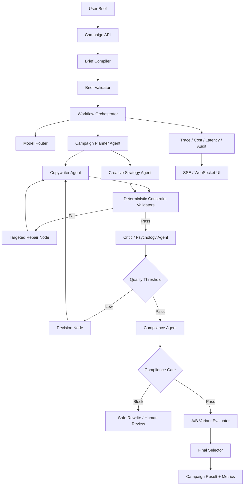
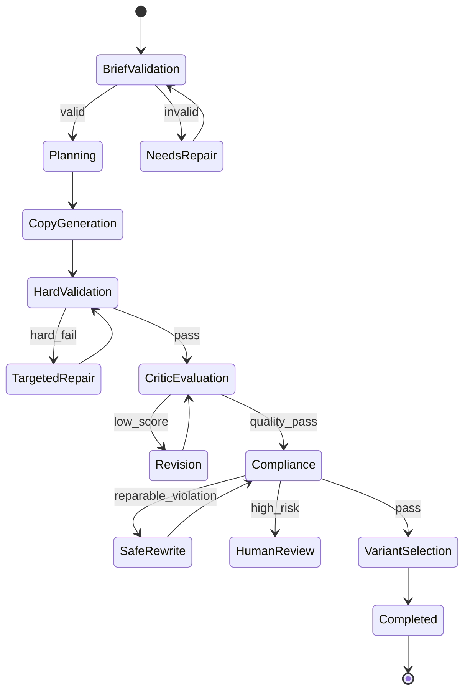
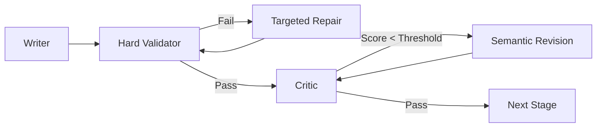
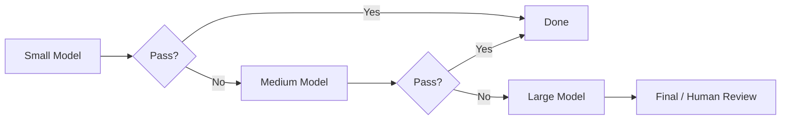
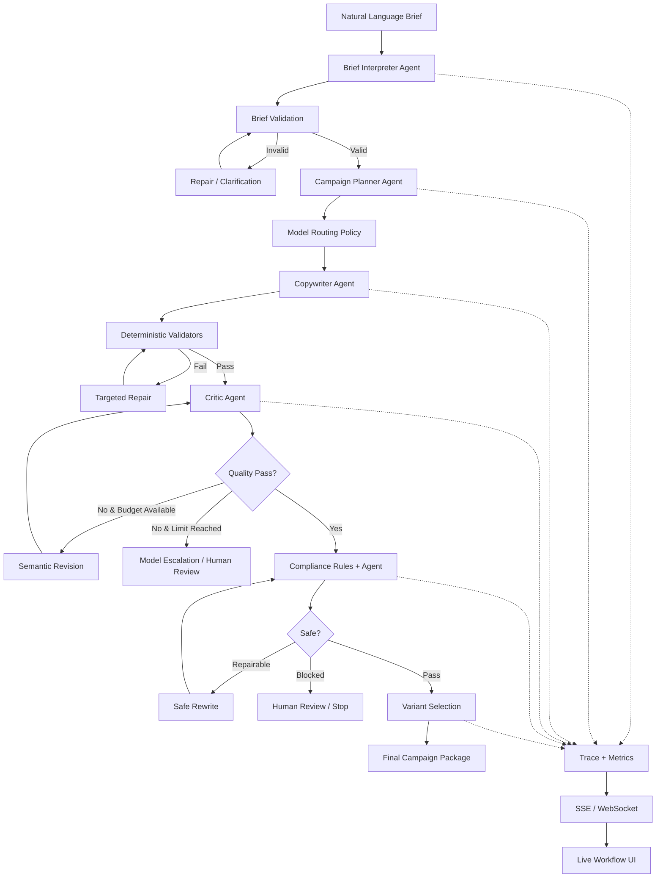

# Profesyonel Reklam Üretim ve Analiz Sistemi — Agentic AI Orchestration Lab

> **Detaylı proje planı — Ağustos 2026**  
> Amaç: Reklam üretimini yalnızca ilk uygulama alanı olarak kullanan; gerçek dünya kısıtları altında çoklu yapay zekâ ajanlarını planlayan, yönlendiren, eleştiren, doğrulayan ve optimize eden; ileride finans, siber güvenlik, araştırma, yazılım mühendisliği veya başka domain'lere taşınabilecek **jenerik bir Agentic AI workflow ve orchestration çekirdeği** geliştirmek.

---

# 0. Projenin Nihai Tanımı

Bu proje bir **“AI reklam yazarı”** değildir.

Doğru konumlandırma şudur:

> **Katı çıktı sözleşmeleri, platform kısıtları, kalite hedefleri, güvenlik/uyum kuralları, maliyet bütçeleri ve gecikme hedefleri altında; birden fazla AI ajanını state-machine/graph tabanlı bir iş akışı içerisinde yöneten, çıktıları deterministik kurallarla doğrulayan, gerektiğinde self-correction döngülerine sokan ve model/tool seçimlerini dinamik biçimde optimize eden bir Agentic AI Orchestration Platformu.**

Reklam domain'i burada özellikle iyi bir ilk test alanıdır; çünkü:

- girdiler anlaşılırdır,
- çıktılar hızlı değerlendirilebilir,
- karakter ve format sınırları nettir,
- kalite tamamen tek boyutlu değildir,
- farklı ajan rollerine doğal biçimde bölünebilir,
- uyum/güvenlik katmanı eklemeye uygundur,
- multimodal üretime genişleyebilir,
- A/B varyantları üretilebilir,
- token ve latency maliyetleri ölçülebilir,
- orchestration mimarisi başka alanlara taşınabilir.

Sistemin örnek kullanım senaryosu:

> “25–34 yaş arası teknoloji meraklılarına yönelik yeni bir kablosuz kulaklık için Instagram ve TikTok kampanyası hazırla. Marka tonu premium ama samimi olsun. Instagram başlığı 40 karakteri geçmesin. Abartılı sağlık iddiaları kullanma. Üç farklı yaratıcı yaklaşım üret ve en güçlü olanı seç.”

Sistem bunu doğrudan tek bir LLM çağrısına göndermek yerine şu workflow'a dönüştürür:

1. Brief'i yapılandırılmış bir `CampaignBrief` sözleşmesine çevirir.
2. Eksik veya çelişkili gereksinimleri tespit eder.
3. Kampanya stratejisini planlar.
4. Platforma uygun yaratıcı kısıtları belirler.
5. Uygun model rotasını seçer.
6. Copywriter Agent varyantlar üretir.
7. Deterministik validator'lar karakter, alan ve format limitlerini denetler.
8. Critic Agent semantik kalite değerlendirmesi yapar.
9. Compliance Agent riskli iddiaları ve politika ihlallerini değerlendirir.
10. Gerekirse yalnızca başarısız bölümler revision döngüsüne girer.
11. A/B Agent farklı varyantları karşılaştırır.
12. Cost/Latency Controller workflow'un bütçe sınırlarını denetler.
13. Final Selector Agent veya deterministik karar politikası en güçlü çıktıyı seçer.
14. Kullanıcıya final kampanya paketinin yanında kalite, maliyet, latency ve revision geçmişi sunulur.

---

# 1. En Önemli Mimari Prensip: LLM Her Şeyi Yapmamalı

Bu projeyi sıradanlaştırabilecek en büyük hata şudur:

```text
User -> Prompt -> LLM -> Advertisement
```

Bu yapı bir **prompt wrapper** olur; agentic orchestration projesi olmaz.

Doğru yapı:

```text
User
  ↓
Structured Brief Compiler
  ↓
Workflow Planner / Graph
  ↓
Specialized Agents
  ↓
Deterministic Validators + Tools
  ↓
Reflection / Revision Loops
  ↓
Compliance Gate
  ↓
Cost & Latency Controller
  ↓
Final Output + Trace + Metrics
```

## 1.1 LLM'nin sorumlu olacağı işler

LLM tabanlı ajanlar:

- kullanıcı niyetini anlamalı,
- yaratıcı fikir üretmeli,
- hedef kitleyi semantik olarak analiz etmeli,
- alternatif stratejiler önermeli,
- ton ve mesaj uyumunu değerlendirmeli,
- eleştiri üretmeli,
- revision önerileri geliştirmeli,
- karmaşık doğal dil kurallarını yorumlamalı.

## 1.2 Java / deterministic servislerin sorumlu olacağı işler

Deterministik sistem:

- karakter sayısını ölçmeli,
- zorunlu alanların varlığını kontrol etmeli,
- JSON schema doğrulaması yapmalı,
- retry limitlerini uygulamalı,
- token bütçesini takip etmeli,
- latency ölçmeli,
- rate-limit uygulamalı,
- workflow transition kurallarını çalıştırmalı,
- model seçim politikalarını uygulamalı,
- izin verilmeyen tool çağrılarını engellemeli,
- exact platform constraint'lerini doğrulamalı,
- audit log üretmeli.

### Temel prensip

> **LLM = muhakeme / üretim bileşeni**  
> **Orchestrator = süreç otoritesi**  
> **Validator = doğruluk ve sınır otoritesi**

Bu üç rol birbirinden ayrılmalıdır.

---

# 2. Bu Projenin Asıl Öğrenme Hedefleri

Projenin başarı kriteri “güzel reklam üretti” olmamalıdır.

Asıl teknik hedefler:

1. Çoklu ajanlar arasında tipli veri aktarımı kurmak.
2. Graph/state-machine tabanlı dinamik workflow geliştirmek.
3. Reflection ve self-correction döngülerini güvenli şekilde sınırlamak.
4. Structured output sözleşmelerini Java domain modelleri ile bağlamak.
5. Tool calling altyapısı geliştirmek.
6. Multi-model routing uygulamak.
7. Cost-aware ve latency-aware orchestration geliştirmek.
8. Deterministik ve LLM tabanlı değerlendirmeyi hibrit kullanmak.
9. Agent state ve execution trace yönetmek.
10. Guardrail/compliance gate geliştirmek.
11. Uzun çalışan AI workflow'larını gerçek zamanlı frontend'e aktarmak.
12. Agent hatalarını retry/fallback/escalation mekanizmalarıyla yönetmek.
13. Workflow'u ölçülebilir benchmark'larla test etmek.
14. Aynı agentic kernel'i farklı domain'lere taşınabilir hale getirmek.

---

# 3. Projenin Jenerik Hale Getirilmesi: Reklam Domain'i Bir “Domain Pack” Olmalı

Çekirdek sistem reklam mantığını bilmemelidir.

Core yalnızca şu kavramları bilmelidir:

- workflow,
- node,
- transition,
- agent,
- tool,
- state,
- constraint,
- evaluator,
- policy,
- retry,
- budget,
- trace,
- result.

Reklam domain'i ise ayrı bir modül olmalıdır:

```text
agentic-core/
    orchestration/
    state/
    model-routing/
    tool-runtime/
    validation/
    observability/

ad-domain/
    agents/
    validators/
    policies/
    tools/
    prompts/
    platform-rules/
    workflow/
```

Böylece ileride:

```text
cybersecurity-domain/
finance-domain/
research-domain/
software-review-domain/
```

modülleri aynı çekirdeğe bağlanabilir.

### Nihai vizyon

> **Core = Agentic Runtime**  
> **Advertising = İlk Domain Plugin**

Bu ayrım projenin gelecekte tekrar kullanılabilirliğini dramatik biçimde artırır.

---

# 4. Üst Seviye Sistem Mimarisi



---

# 5. Önerilen Teknoloji Yığını

## Backend

- Java 21
- Spring Boot 4.1.x
- Spring AI 2.0.x
- Spring MVC
- Spring WebSocket veya SSE
- PostgreSQL
- Flyway
- Spring Data JPA
- Spring Validation
- Spring Security
- Maven

## AI entegrasyonu

- Spring AI `ChatClient`
- Spring AI Tool Calling
- Structured Output / Java record mapping
- Native Structured Output destekleyen modellerde schema tabanlı output
- Yerel model seçeneği için Ollama entegrasyonu
- Cloud model adapter'ları

## Frontend

Başlangıç için:

- Thymeleaf
- Vanilla JS
- Chart.js
- SSE veya WebSocket

İleri sürüm:

- React/Vue gibi ayrı frontend düşünülebilir; fakat ilk iki haftada orchestration odağını dağıtmamak için zorunlu değildir.

## Observability

- Micrometer
- Spring Boot Actuator
- structured logging
- workflow trace tablosu
- model/token/latency metrikleri

## Test

- JUnit 5
- Mockito
- Spring Boot Test
- Testcontainers PostgreSQL
- WireMock veya mock model adapter
- Golden dataset regression testleri

---

# 6. Güncel Spring AI Kullanımı İçin Teknik Not

Plan Spring AI 2.0.x temel alınarak tasarlanabilir.

Ağustos 2026 itibarıyla Spring AI 2.0.x, Spring Boot 4.0.x ve 4.1.x ile uyumludur. Dependency version'larını doğrudan tek tek sabitlemek yerine Spring AI BOM kullanmak daha sağlıklıdır.

Structured output için iki katmanlı yaklaşım kullanılmalıdır:

1. model native structured output destekliyorsa JSON Schema tabanlı native output,
2. desteklemiyorsa Spring AI `BeanOutputConverter` / typed entity conversion + uygulama tarafı validation.

Önemli nokta:

> Structured output dönüşümü başarılı olsa bile **domain validation ayrıca yapılmalıdır**.

Tool calling için de ajanlara doğrudan sistem erişimi vermek yerine Spring AI tool abstraction üzerinden sınırlı ve tipli fonksiyonlar sunulmalıdır.

---

# 7. Katmanlı Mimari

## Layer 1 — Presentation

Sorumluluklar:

- campaign brief formu,
- workflow canlı görünümü,
- agent status kartları,
- token/cost paneli,
- revision timeline,
- final creative paneli,
- A/B variant karşılaştırması,
- compliance findings.

## Layer 2 — API / Application

Sorumluluklar:

- workflow oluşturma,
- run başlatma,
- cancel etme,
- state sorgulama,
- result getirme,
- live event stream yönetimi.

## Layer 3 — Orchestration Core

Projenin en önemli katmanı.

Sorumluluklar:

- node execution,
- transition resolution,
- retry,
- branch,
- loop,
- timeout,
- budget,
- cancellation,
- state persistence,
- failure recovery.

## Layer 4 — Agent Layer

Her ajan yalnızca sınırlı role sahip olmalıdır.

## Layer 5 — Deterministic Services

- constraint validation,
- scoring primitives,
- cost calculator,
- token estimator,
- platform rules,
- policy rules,
- text statistics.

## Layer 6 — Model Gateway

- OpenAI-compatible model,
- local Ollama model,
- diğer provider'lar,
- fallback modeli.

Agent'lar provider SDK'larını doğrudan çağırmamalıdır.

## Layer 7 — Persistence / Observability

- workflow state,
- trace,
- prompt version,
- tool call,
- evaluation,
- model usage,
- final result.

---

# 8. Agentic Core İçin Ana Interface'ler

## 8.1 `AgentNode`

```java
public interface AgentNode<I, O> {
    O execute(I input, AgentExecutionContext context);
}
```

Her ajan:

- girdisini açıkça tanımlar,
- çıktısını açıkça tanımlar,
- workflow state'i keyfi şekilde değiştirmez,
- yalnızca izin verilen tool'ları kullanır.

## 8.2 `WorkflowNode`

```java
public interface WorkflowNode {
    NodeResult execute(WorkflowState state);
}
```

Node yalnızca LLM ajanı olmak zorunda değildir.

Node türleri:

- `AgentNode`
- `ValidationNode`
- `DecisionNode`
- `ToolNode`
- `HumanReviewNode`
- `PersistenceNode`
- `AggregationNode`

Bu ayrım çok önemlidir.

Her adımı “agent” yapmak mimariyi gereksiz yere pahalı ve kırılgan hale getirir.

---

# 9. Workflow State Tasarımı

Merkezi mutable bir `Map<String,Object>` kullanmak ilk başta kolay görünür, fakat büyüyünce kontrolden çıkar.

Bunun yerine tipli state önerilir.

```java
public record CampaignWorkflowState(
    UUID runId,
    WorkflowStatus status,
    CampaignBrief brief,
    CampaignPlan plan,
    List<AdVariant> variants,
    List<EvaluationResult> evaluations,
    List<ComplianceFinding> complianceFindings,
    UsageBudget usageBudget,
    WorkflowCounters counters,
    Instant updatedAt
) {}
```

## State prensipleri

- mümkün olduğunca immutable snapshot,
- her transition sonrası version artışı,
- optimistic locking,
- replay edilebilir event kayıtları,
- node output'ları trace'e ayrı yazılmalı.

### Neden?

Aynı run içerisinde:

- hangi ajan ne üretti,
- hangi output neden reddedildi,
- kaç kez retry edildi,
- hangi model kullanıldı,
- final çıktıya nasıl ulaşıldı

izlenebilir hale gelir.

---

# 10. State Machine / Graph Modeli

Workflow sabit bir pipeline olmamalıdır.

Örneğin:



Bu yapı ileride başka domain'lerde de kullanılabilir.

---

# 11. Workflow Transition Kuralları

Transition'lar mümkün olduğunca kod seviyesinde açıkça ifade edilmelidir.

Örnek:

```java
if (!validationResult.hardConstraintsPassed()) {
    return Transition.to("targeted-repair");
}

if (state.counters().revisionCount() >= 3) {
    return Transition.to("fallback-model-review");
}

if (evaluation.overallScore() < 0.75) {
    return Transition.to("semantic-revision");
}

return Transition.to("compliance-check");
```

LLM'nin “şimdi hangi ajana gideyim?” diye tamamen serbest karar vermesi yerine:

> **LLM önerir, orchestrator transition policy'yi uygular.**

Bu yaklaşım güvenilirliği artırır.

---

# 12. Workflow Guardrails: Sonsuz Döngüleri Önleme

Reflection mimarisinde en ciddi problemlerden biri:

```text
Writer -> Critic -> Writer -> Critic -> ...
```

sonsuz döngüsüdür.

Her workflow run için:

```java
public record WorkflowLimits(
    int maxAgentCalls,
    int maxRevisionCycles,
    int maxToolCalls,
    Duration maxDuration,
    long maxInputTokens,
    long maxOutputTokens,
    BigDecimal maxEstimatedCost
) {}
```

tanımlanmalıdır.

Exit condition örnekleri:

- score >= threshold,
- hard constraints pass,
- max revision reached,
- budget exhausted,
- timeout,
- unrecoverable compliance violation,
- user cancellation.

---

# 13. Ana Ajan Rolleri

İlk sürümde 10–15 agent yapmak yerine az ama güçlü roller seçilmelidir.

Önerilen MVP ajanları:

1. Brief Interpreter
2. Campaign Planner
3. Copywriter
4. Critic / Audience Psychology Evaluator
5. Compliance Agent
6. Final Selector

İleri sürüm:

7. Creative Director
8. A/B Experiment Agent
9. Multimodal Reviewer
10. Competitor Analysis Agent

Model Router'ın kendisinin mutlaka LLM agent olması gerekmez; tercihen **deterministik policy service + opsiyonel LLM classifier** şeklinde tasarlanmalıdır.

---

# 14. Agent 1 — Brief Interpreter / Requirements Agent

Görev:

Kullanıcı doğal dilini `CampaignBrief` nesnesine dönüştürmek.

```java
public record CampaignBrief(
    String product,
    String objective,
    AudienceSpec audience,
    BrandVoice brandVoice,
    List<PlatformTarget> platforms,
    List<String> requiredClaims,
    List<String> forbiddenClaims,
    Locale locale,
    CampaignConstraints constraints
) {}
```

## Sorumluluklar

- ürün/hizmeti çıkarma,
- hedef kitle çıkarma,
- platformları belirleme,
- ton belirleme,
- kullanıcı constraint'lerini çıkarma,
- belirsizlikleri işaretleme.

## Yapmaması gerekenler

- reklamı yazmak,
- compliance kararı vermek,
- final kalite değerlendirmesi yapmak.

---

# 15. Brief Quality Gate

Brief Interpreter çıktısı doğrudan Planner'a gitmemelidir.

Önce validator:

```text
Product present?          PASS
Objective present?        PASS
Target platform?          PASS
Audience?                 WARN
Constraints parseable?    PASS
Contradiction detected?   FAIL
```

`BriefValidationResult`:

```java
public record BriefValidationResult(
    boolean valid,
    List<ValidationIssue> issues,
    double completenessScore
) {}
```

Belirsiz alanlar iki şekilde yönetilebilir:

- kritikse kullanıcıya soru,
- kritik değilse varsayım yapıp `assumptions` alanına kayıt.

---

# 16. Agent 2 — Campaign Planner

Bu ajan reklam metni yazmamalıdır.

Çıktısı:

```java
public record CampaignPlan(
    String coreMessage,
    List<String> persuasionAngles,
    List<String> audiencePainPoints,
    List<String> desiredActions,
    List<CreativeDirection> creativeDirections,
    List<PlatformPlan> platformPlans
) {}
```

Planner şu sorulara cevap verir:

- Kampanya neyi optimize etmeli?
- Kullanıcı hangi acı noktasına hitap edilmeli?
- Hangi mesaj açısı kullanılmalı?
- Platforma göre mesaj nasıl değişmeli?
- Kaç varyant üretilecek?

Bu adım “planning” design pattern'ini gerçekten görünür hale getirir.

---

# 17. Agent 3 — Copywriter Agent

Copywriter yalnızca verilen `CampaignPlan` ve constraint'lere göre varyant üretir.

Çıktı:

```java
public record AdVariant(
    UUID id,
    String concept,
    String headline,
    String primaryText,
    String hook,
    String callToAction,
    PlatformType platform,
    List<String> assumptions
) {}
```

## Kritik tasarım

Copywriter'dan:

> “Başlığın 40 karakteri geçmediğinden emin ol.”

istemek yeterli değildir.

Gerçek kontrol Java tarafında yapılmalıdır.

---

# 18. Deterministic Hard Constraint Validator

Bu proje için en değerli engineering parçalarından biridir.

```java
public interface ConstraintValidator<T> {
    ValidationResult validate(T candidate, ValidationContext context);
}
```

Örnek validator'lar:

```text
HeadlineLengthValidator
RequiredFieldValidator
ForbiddenTermValidator
PlatformFieldValidator
UrlValidator
HashtagCountValidator
EmojiLimitValidator
RequiredDisclosureValidator
```

Örnek sonuç:

```json
{
  "passed": false,
  "violations": [
    {
      "field": "headline",
      "rule": "MAX_LENGTH",
      "expected": 40,
      "actual": 47
    }
  ]
}
```

Bu veri doğrudan `Targeted Repair Node`'a gider.

---

# 19. Targeted Repair Yaklaşımı

Bir alan başarısızsa bütün reklamı yeniden üretmek maliyetlidir.

Yanlış:

```text
Headline 47 karakter -> reklamın tamamını yeniden yaz.
```

Doğru:

```text
Sadece headline alanını, anlamı koruyarak 40 karakter altına indir.
```

`RepairRequest`:

```java
public record RepairRequest(
    UUID variantId,
    String field,
    String currentValue,
    List<ConstraintViolation> violations,
    String semanticIntent
) {}
```

Bu özellik:

- token azaltır,
- latency düşürür,
- yaratıcı bütünlüğü korur,
- workflow'u daha profesyonel hale getirir.

---

# 20. Agent 4 — Critic / Psychology Evaluator

Bu ajanın görevi deterministic constraint kontrolü değildir.

Semantik kriterler:

- message clarity,
- audience relevance,
- value proposition strength,
- brand voice consistency,
- persuasion quality,
- specificity,
- originality,
- call-to-action strength.

Çıktı kesinlikle structured olmalıdır.

```java
public record EvaluationResult(
    UUID variantId,
    double clarity,
    double relevance,
    double persuasion,
    double brandAlignment,
    double originality,
    double ctaStrength,
    double overallScore,
    List<EvaluationIssue> issues,
    RevisionRecommendation recommendation
) {}
```

## Çok önemli akademik ayrım

“FOMO = %73” gibi bir sayı **objektif matematiksel gerçek değildir**.

Bu nedenle raporlama dili:

- `criticScore`,
- `rubricScore`,
- `modelBasedEvaluationScore`

şeklinde olmalıdır.

Bu puanlar ancak oluşturduğunuz rubric'in değerlendirme skorlarıdır.

---

# 21. Reflection / Self-Correction Döngüsü



## Revision policy

Örnek:

```text
Cycle 0 -> small/local model generation
Cycle 1 -> same model targeted revision
Cycle 2 -> stronger model revision
Cycle 3 -> stop / accept-best / human-review
```

Bu mekanizma **dynamic escalation** için doğal bir test alanıdır.

---

# 22. Agent 5 — Compliance & Guardrail Agent

Compliance Agent projenin AI safety/governance tarafını güçlendirir.

Ancak bu ajan tek başına hukuki doğruluk kaynağı olarak görülmemelidir.

İdeal yapı:

```text
Policy Corpus / Rule Set
        ↓
Deterministic Rules
        +
Compliance LLM Agent
        ↓
Compliance Decision
```

## Risk türleri

- yasaklı veya kısıtlı iddialar,
- misleading claims,
- unverifiable superlatives,
- hassas kişisel özelliklere dayalı uygunsuz targeting dili,
- platform-specific restricted categories,
- required disclosure eksikleri,
- marka tarafından yasaklanan kelimeler.

## Çıktı

```java
public record ComplianceFinding(
    String code,
    RiskLevel severity,
    String field,
    String explanation,
    String policyReference,
    boolean autoRepairable
) {}
```

Severity:

```text
INFO
LOW
MEDIUM
HIGH
BLOCK
```

---

# 23. Compliance Gate

Compliance Agent yalnızca rapor üretmemeli; workflow üzerinde gerçek etkisi olmalıdır.

```text
LOW -> proceed
MEDIUM -> auto rewrite + re-check
HIGH -> stronger review model
BLOCK -> workflow stop / human review
```

Bu noktada “agent” gerçekten sistem davranışını değiştiren bir bileşen haline gelir.

---

# 24. Policy Knowledge Nasıl Yönetilmeli?

Yasal/platform politikalarını system prompt içine gömmek uzun vadede kötü tasarımdır.

Öneri:

```text
PolicySource
  id
  jurisdiction
  platform
  category
  version
  effectiveDate
  sourceUrl
  contentHash
```

Compliance run sırasında hangi policy version'larının kullanıldığı audit log'a yazılmalıdır.

RAG burada kullanılabilir; fakat projenin ana konusu RAG olmamalıdır.

RAG yalnızca:

- güncel policy maddelerini getirmek,
- kaynaklı compliance açıklaması oluşturmak

için yardımcı servis olabilir.

---

# 25. Model Router — Agent Değil, Akıllı Bir Policy Layer

“Cost Optimizer Agent” fikri değerlidir; fakat tüm routing kararını LLM'ye bırakmak gereksizdir.

Daha iyi mimari:

```text
Request Complexity Classifier
        ↓
Routing Policy Engine
        ↓
Model Gateway
```

Model profili:

```java
public record ModelProfile(
    String id,
    ModelTier tier,
    boolean supportsTools,
    boolean supportsStructuredOutput,
    boolean supportsVision,
    long contextWindow,
    BigDecimal estimatedInputUnitCost,
    BigDecimal estimatedOutputUnitCost,
    Duration targetLatency
) {}
```

---

# 26. Dynamic Model Routing

Örnek politika:

```text
Simple rewrite             -> SMALL
Brief parsing              -> SMALL
Campaign planning          -> MEDIUM
Initial copy generation    -> MEDIUM
Hard constraint repair     -> SMALL
Deep critic disagreement   -> LARGE
High-risk compliance       -> LARGE
Final synthesis            -> MEDIUM/LARGE
```

Böylece pahalı modeli her node'da kullanmak yerine yalnızca gerçekten gerektiğinde kullanırsınız.

---

# 27. Escalation Policy



Escalation trigger'ları:

- schema fail,
- repeated low score,
- compliance uncertainty,
- contradictory outputs,
- planner/critic disagreement,
- retry threshold.

---

# 28. Token-Cost Budgeting

Her workflow run için bütçe tutulmalıdır.

```java
public record UsageBudget(
    long maxInputTokens,
    long maxOutputTokens,
    BigDecimal maxEstimatedCost,
    long usedInputTokens,
    long usedOutputTokens,
    BigDecimal estimatedCost
) {}
```

Her model çağrısından sonra:

```text
input_tokens
output_tokens
model
node
latency
retry_count
estimated_cost
```

kaydedilir.

### Temel ölçüt

> **cost per accepted output**

Yani yalnızca toplam token değil, final kabul edilen reklam başına harcanan maliyet ölçülmelidir.

---

# 29. Latency-Aware Routing

Maliyet kadar gecikme de önemlidir.

Bazı node'lar paralel çalışabilir:

```text
              -> Variant A Critic
Copywriter ---|-> Variant B Critic
              -> Variant C Critic
```

Ancak paralellik limitsiz olmamalıdır.

Tanımlanacak:

```java
ConcurrencyPolicy(
    int maxParallelModelCalls,
    int maxParallelToolCalls
)
```

Ölçülecek:

- total workflow latency,
- p50 node latency,
- p95 node latency,
- queue wait,
- provider latency,
- validation latency.

---

# 30. Tool Calling Katmanı

Agent'lar Java servislerini doğrudan bilmek yerine tanımlı tool'lar görmelidir.

Örnek tool'lar:

```text
countCharacters
checkPlatformConstraints
lookupPolicy
calculateReadability
extractClaims
saveCampaignDraft
loadBrandGuide
compareVariants
requestImageGeneration
```

Spring AI `@Tool` kullanılabilir.

Örnek:

```java
@Component
public class CopyValidationTools {

    @Tool(description = "Returns the exact Unicode character count for a text field")
    public CharacterCountResult countCharacters(String text) {
        return new CharacterCountResult(text.codePointCount(0, text.length()));
    }
}
```

---

# 31. Tool Security

Her tool için:

- input schema,
- maximum payload,
- timeout,
- permission,
- idempotency behavior,
- rate limit,
- audit requirement

tanımlanmalıdır.

Agent hiçbir zaman:

- arbitrary SQL,
- arbitrary filesystem,
- arbitrary HTTP,
- shell command

gibi geniş yetkili tool almamalıdır.

### Principle

> **Capabilities, not unrestricted access.**

---

# 32. Tool Registry

```java
public record ToolDefinition(
    String name,
    String capability,
    RiskLevel risk,
    Set<String> allowedAgents,
    Duration timeout
) {}
```

Örnek:

```text
Copywriter -> countCharacters
Compliance -> lookupPolicy
Planner -> loadBrandGuide
FinalSelector -> compareVariants
```

Agent'a workflow node'unda yalnızca gereken tool'lar verilmelidir.

---

# 33. Structured Output Tasarımı

Bu projede ajanlar mümkün olduğunca düz metin yerine tipli Java record döndürmelidir.

Örnek:

```java
public record RevisionDecision(
    boolean requiresRevision,
    List<String> failedCriteria,
    List<String> instructions,
    double confidence
) {}
```

Structured output sonrası:

1. deserialization,
2. bean validation,
3. semantic validation,
4. business rule validation

yapılmalıdır.

---

# 34. Structured Output Failure Recovery

Olası durum:

```text
Model -> malformed JSON
```

Workflow:

```text
Parse fail
   ↓
Schema repair retry
   ↓
Still fail?
   ↓
Fallback model
   ↓
Still fail?
   ↓
Node failed
```

Bu hata yönetimi ayrı bir `StructuredOutputRecoveryPolicy` olmalıdır.

---

# 35. Prompt Registry ve Prompt Versioning

Prompt'ları Java class'larının içine gömmek yerine version'lamak gerekir.

```text
prompts/
  brief-interpreter/
    v1.md
    v2.md
  planner/
    v1.md
  copywriter/
    v1.md
  critic/
    v1.md
```

`PromptTemplateMetadata`:

```text
prompt_id
version
agent_type
created_at
hash
```

Her run için kullanılan prompt version kaydedilir.

Bu sayede benchmark sonucundaki değişimin:

- modelden mi,
- prompt'tan mı,
- workflow'dan mı

geldiğini ölçebilirsiniz.

---

# 36. Agent Memory Tasarımı

“Shared Memory” tek bir dev conversation history olmamalıdır.

Üç farklı memory türü ayırın.

## 36.1 Workflow State

Run'a ait gerçek bilgiler.

## 36.2 Agent Context

Ajanın o node için ihtiyacı olan sınırlı bağlam.

## 36.3 Long-Term Knowledge

- brand guide,
- policy corpus,
- campaign templates,
- approved vocabulary.

Her ajan tüm geçmişi görmemelidir.

Bu token tüketimini ve prompt contamination riskini azaltır.

---

# 37. Context Builder

Her node öncesi gereken context dinamik üretilmelidir.

```java
public interface AgentContextBuilder {
    AgentContext build(WorkflowState state, AgentDefinition agent);
}
```

Örneğin Copywriter:

- brief,
- campaign plan,
- platform rules,
- brand voice

görür.

Compliance Agent:

- final candidate,
- policy snippets,
- claims

görür.

Planner'ın tüm critic geçmişini görmesine gerek yoktur.

---

# 38. “Reasoning” Akışını Frontend'e Vermeyin

Frontend'de ajanların gizli chain-of-thought muhakemesini yayınlamak yerine şu veriler gösterilmelidir:

```text
Planning campaign strategy...
Generating 3 variants...
Headline validation failed: 44/40 chars
Repairing headline...
Critic score: 0.72
Revision requested: CTA too generic
Compliance check passed
Selecting final variant...
```

Yani kullanıcıya:

- status,
- karar özeti,
- tool sonucu,
- validation sonucu,
- transition nedeni,
- ölçümler

gösterilir.

Bu hem daha güvenli hem de daha profesyoneldir.

---

# 39. Live Workflow Event Model

```java
public record WorkflowEvent(
    UUID runId,
    long sequence,
    WorkflowEventType type,
    String nodeId,
    String message,
    Instant timestamp,
    Map<String, Object> metadata
) {}
```

Event türleri:

```text
RUN_STARTED
NODE_STARTED
MODEL_CALL_STARTED
MODEL_CALL_COMPLETED
TOOL_CALLED
VALIDATION_FAILED
REVISION_REQUESTED
MODEL_ESCALATED
COMPLIANCE_WARNING
NODE_COMPLETED
RUN_COMPLETED
RUN_FAILED
```

---

# 40. SSE mi WebSocket mi?

## SSE

Avantaj:

- kolay,
- server -> client akışı için ideal,
- MVP için yeterli.

Kullanıcı sadece ilerlemeyi izliyorsa SSE seçilebilir.

## WebSocket

Gerekli olduğunda:

- run pause,
- resume,
- kullanıcı müdahalesi,
- canlı constraint değişimi,
- human approval

gibi çift yönlü etkileşim sağlar.

### Öneri

MVP:

> **SSE**

V2:

> **WebSocket/STOMP**

---

# 41. Asenkron Execution Modeli

HTTP request içerisinde 40 saniyelik workflow çalıştırılmamalıdır.

Öneri:

```text
POST /api/workflows
        ↓
return runId immediately
        ↓
background WorkflowExecutor
        ↓
SSE events
        ↓
GET /api/workflows/{id}/result
```

MVP için tek uygulama içinde executor yeterlidir.

İleri sürüm:

- queue,
- Redis Streams,
- Kafka,
- external worker

düşünülebilir.

Fakat ilk sürümde dağıtık mimari eklemek orchestration öğrenme hedefini gereksiz yere dağıtabilir.

---

# 42. Workflow Executor

```java
public interface WorkflowExecutor {
    WorkflowRun start(WorkflowDefinition definition, WorkflowInput input);
    void cancel(UUID runId);
    WorkflowSnapshot getSnapshot(UUID runId);
}
```

Executor sorumlulukları:

- current node,
- transition,
- budget,
- retry,
- timeout,
- persistence,
- event publish.

---

# 43. Node Execution Result

```java
public record NodeResult(
    NodeStatus status,
    Object output,
    Transition transition,
    NodeMetrics metrics,
    List<WorkflowEvent> events
) {}
```

Bu interface sayesinde:

- LLM Agent,
- Validator,
- Tool,
- Decision Node

aynı runtime içerisinde yürütülebilir.

---

# 44. A/B Variant Agent

A/B Agent'ın işi gerçek CTR tahmini yapıyormuş gibi davranmak olmamalıdır.

İlk sürümde:

- farklı mesaj angle'ları,
- farklı CTA'lar,
- farklı tonlar,
- farklı hook'lar

üreterek varyant karşılaştırabilir.

Değerlendirme:

```text
Hard constraints
+ Critic rubric
+ Compliance
+ diversity score
+ optional historical performance
```

Gerçek geçmiş campaign verisi yoksa “bu kesin daha fazla dönüşüm getirir” denmemelidir.

---

# 45. Variant Diversity

Üç varyant aynı metnin küçük değişiklikleri olmamalıdır.

`DiversityEvaluator`:

- semantic similarity,
- angle similarity,
- CTA similarity,
- vocabulary overlap

ölçebilir.

Amaç:

```text
A = urgency angle
B = social proof angle
C = product benefit angle
```

şeklinde gerçekten farklı stratejiler elde etmek.

---

# 46. Final Selector

Final seçim yalnızca LLM preference olmamalıdır.

Örnek weighted score:

```text
hard constraint pass   = mandatory
compliance pass        = mandatory
critic quality         = 35%
brand alignment        = 20%
audience relevance     = 20%
originality            = 10%
CTA strength           = 10%
cost efficiency        = 5%
```

Ağırlıklar konfigürasyondan gelmelidir.

---

# 47. Scoring Engine

```java
public interface ScoreComponent<T> {
    Score calculate(T input, ScoringContext context);
}
```

Score kaynakları:

- deterministic,
- LLM rubric,
- embedding similarity,
- historical data,
- human rating.

Bu altyapı ileride başka projelerde doğrudan yeniden kullanılabilir.

---

# 48. Human-in-the-Loop Desteği

Tam otonomi her zaman en iyi tasarım değildir.

Human Review Node:

```text
High-risk compliance
Low confidence
Conflicting critics
Budget exhausted
Brand-sensitive campaign
```

durumlarında kullanılabilir.

UI:

```text
[Approve]
[Request Revision]
[Reject]
```

Bu yapı enterprise agentic sistemler için çok değerlidir.

---

# 49. Multimodal Creative Extension

İlk iki haftalık MVP için zorunlu değildir.

V2'de:

```text
Creative Director Agent
      ↓
Image Brief
      ↓
Image Generation Tool
      ↓
Vision Reviewer
      ↓
Brand / Compliance Check
```

`VisualCreativeSpec`:

```java
public record VisualCreativeSpec(
    String scene,
    String composition,
    String brandMood,
    String textOverlay,
    String aspectRatio,
    List<String> forbiddenElements
) {}
```

Bu katman multi-modal agent orchestration deneyimi kazandırır.

---

# 50. Model Gateway

Agent implementation doğrudan provider sınıfına bağımlı olmamalıdır.

```java
public interface AiModelGateway {
    <T> T generate(ModelRequest<T> request);
}
```

Gateway:

- provider seçer,
- timeout uygular,
- usage toplar,
- tracing yapar,
- fallback uygular.

Bu sayede model değişikliği agent kodunu bozmaz.

---

# 51. Resilience

AI provider çağrıları başarısız olabilir.

Ele alınacak durumlar:

- timeout,
- 429 rate limit,
- 5xx,
- invalid structured output,
- content rejection,
- tool error,
- local model unavailable.

Policy:

```text
retry same model
    ↓
fallback provider
    ↓
reduce task complexity
    ↓
human review / fail safely
```

Exponential backoff ve circuit breaker V2'de eklenebilir.

---

# 52. Güvenlik Mimarisi

## Prompt Injection

Brand guide veya policy corpus içerisindeki metin “instruction” değil veri olarak işlenmelidir.

## Tool Abuse

Tool allowlist uygulanmalıdır.

## Input validation

Kullanıcı brief'i:

- max length,
- format,
- file type,
- HTML escaping

kontrolünden geçmelidir.

## Secret management

API key'ler:

- `.env`,
- environment variable,
- secret manager

üzerinden verilmelidir.

Repo'ya yazılmamalıdır.

---

# 53. Reklam Domain'inde Guardrail Hiyerarşisi

```text
1. User constraints
2. Brand constraints
3. Platform constraints
4. Safety/compliance constraints
5. Workflow constraints
6. Model/provider constraints
```

Çakışma olduğunda öncelik politikası açık olmalıdır.

Örneğin kullanıcı:

> “Bu sağlık ürününün hastalığı kesin iyileştirdiğini yaz.”

derse user instruction, compliance constraint'in önüne geçmemelidir.

---

# 54. Veritabanı Modeli

Önerilen tablolar:

```text
campaign_briefs
workflow_runs
workflow_state_snapshots
workflow_events
agent_executions
model_calls
tool_calls
ad_variants
evaluations
compliance_findings
prompt_versions
policy_sources
human_reviews
```

---

# 55. `workflow_runs`

Örnek alanlar:

```text
id UUID PK
workflow_type VARCHAR
status VARCHAR
started_at TIMESTAMP
completed_at TIMESTAMP
current_node VARCHAR
input_snapshot JSONB
result_snapshot JSONB
max_cost NUMERIC
estimated_cost NUMERIC
revision_count INT
failure_code VARCHAR
```

---

# 56. `agent_executions`

```text
id UUID
run_id UUID
agent_type VARCHAR
node_id VARCHAR
model_id VARCHAR
prompt_version VARCHAR
status VARCHAR
started_at
completed_at
latency_ms
input_tokens
output_tokens
estimated_cost
```

Bu tablo benchmark için çok değerlidir.

---

# 57. `workflow_events`

```text
sequence
run_id
event_type
node_id
message
metadata JSONB
timestamp
```

Frontend SSE reconnect durumunda son `sequence` değerinden devam edebilir.

---

# 58. REST API Taslağı

```http
POST /api/campaigns
POST /api/campaigns/{id}/runs
GET  /api/runs/{runId}
GET  /api/runs/{runId}/events
GET  /api/runs/{runId}/result
POST /api/runs/{runId}/cancel
POST /api/runs/{runId}/human-review
```

SSE:

```http
GET /api/runs/{runId}/stream
```

---

# 59. Frontend — Live Orchestration View

En etkileyici ekran klasik chat ekranı değil, workflow ekranı olmalıdır.

Örnek:

```text
┌──────────────────────────────────────────┐
│ Campaign Run #A4F2                      │
├──────────────────────────────────────────┤
│ ✓ Brief Interpreter       420 ms        │
│ ✓ Campaign Planner        1.8 s         │
│ ✓ Copywriter              2.4 s         │
│ ! Constraint Validator    headline fail │
│ ✓ Targeted Repair         0.8 s         │
│ ✓ Critic                  score 0.82     │
│ ✓ Compliance              pass           │
│ → Final Selection         running...     │
├──────────────────────────────────────────┤
│ Tokens: 4,821   Cost: ...  Revisions: 1 │
└──────────────────────────────────────────┘
```

Bu ekran projenin orchestration yönünü görünür kılar.

---

# 60. Workflow Graph Visualization

Frontend'de graph:

```text
Brief
  ↓
Planner
  ↓
Writer
  ↓
Validate ──fail──> Repair
  ↓pass               │
Critic <───────────────┘
  ↓
Compliance
  ↓
Final
```

Aktif node highlight edilir.

Bu sunum için güçlü bir görselleştirmedir.

---

# 61. Observability Dashboard

Gösterilecek metrikler:

- workflow latency,
- model calls,
- tool calls,
- retry count,
- revision count,
- hard constraint pass rate,
- first-pass acceptance rate,
- compliance warning rate,
- model escalation rate,
- token usage,
- cost per run.

---

# 62. En Kritik KPI'lar

Projenin teknik başarısını ölçmek için:

## Reliability

```text
Structured Output Success Rate
Hard Constraint Pass Rate
Workflow Completion Rate
Tool Call Success Rate
```

## Quality

```text
Human Preference Score
Rubric Score
Brand Alignment Score
Variant Diversity
```

## Efficiency

```text
Average Tokens / Accepted Variant
Average Cost / Accepted Variant
p50 Workflow Latency
p95 Workflow Latency
Average Revision Cycles
Escalation Rate
```

## Safety

```text
Compliance Violation Detection Recall
False Positive Rate
Unsafe Output Escape Rate
```

---

# 63. Benchmark Dataset

Projede 50–200 adet standart brief oluşturun.

Kategori örnekleri:

- e-commerce,
- mobile app,
- event,
- SaaS olmayan teknik ürün,
- fashion,
- education,
- food,
- finance-adjacent low-risk example,
- ambiguous brief,
- strict-character brief,
- intentionally conflicting constraints.

Her brief için expected hard constraints tutulabilir.

---

# 64. Golden Test Set

Örneğin:

```yaml
id: strict-instagram-001
brief: "..."
required:
  platform: INSTAGRAM
  variants: 3
constraints:
  headline_max: 40
  forbidden_terms:
    - guaranteed
```

Pipeline değiştikçe aynı dataset tekrar çalıştırılır.

Regression kolayca ölçülür.

---

# 65. Human Evaluation Dataset

10–20 brief için insanlar varyantları değerlendirebilir:

```text
clarity: 1-5
persuasion: 1-5
brand fit: 1-5
preference: A/B/C
```

Critic Agent skorlarıyla insan skorlarının korelasyonu incelenebilir.

Bu akademik rapor için güçlü bir deneydir.

---

# 66. Ablation Experiments

Projeyi araştırma seviyesine taşıyan bölüm budur.

## Experiment A

```text
Single LLM vs Multi-Agent Workflow
```

Karşılaştır:

- constraint pass,
- human quality,
- cost,
- latency.

## Experiment B

```text
No Reflection vs Reflection
```

Ölç:

- quality improvement,
- token increase,
- latency increase.

## Experiment C

```text
LLM-only Validation vs Hybrid Deterministic + LLM Validation
```

Beklenen:

Hard constraint reliability hibrit mimaride daha yüksek olmalıdır.

## Experiment D

```text
Fixed Large Model vs Dynamic Model Router
```

Ölç:

- cost,
- quality,
- latency,
- escalation rate.

## Experiment E

```text
Sequential Pipeline vs Graph Workflow
```

Ölç:

- unnecessary calls,
- recovery effectiveness,
- cost.

---

# 67. Potansiyel Araştırma Soruları

### RQ1

> **Can a graph-based multi-agent workflow with deterministic constraint validation improve constraint satisfaction and output quality compared with a single-model advertising generation pipeline?**

### RQ2

> **How does bounded self-reflection affect output quality, latency and token cost in constrained generative workflows?**

### RQ3

> **Can dynamic model routing preserve output quality while reducing the computational cost of multi-agent workflows?**

### RQ4

> **What is the effect of separating deterministic validation from semantic LLM evaluation on the reliability of agentic AI pipelines?**

En güçlü akademik yön RQ2 + RQ3 + RQ4 birleşimidir.

---

# 68. Projeyi “Sadece Reklam” Olmaktan Çıkaran Deney

Final aşamada aynı orchestration core'a küçük ikinci bir domain ekleyin.

Örneğin:

## Software Review Domain

```text
User Requirement
  ↓
Planner
  ↓
Code Review Agent
  ↓
Static Constraint Validator
  ↓
Security Critic
  ↓
Repair
  ↓
Final Review
```

Core değişmeden yalnızca domain node'ları değiştirilirse, reusable architecture iddianızı kanıtlamış olursunuz.

---

# 69. İleride Siber Güvenliğe Dönüşüm

Aynı yapı:

```text
Brief Interpreter       -> Alert Interpreter
Campaign Planner        -> Investigation Planner
Copywriter              -> Hypothesis Generator
Critic                   -> Threat Critic
Compliance Gate          -> Safety Gate
Tool Runtime             -> Security Tools
Final Selector           -> Incident Decision
```

Workflow mantığı aynı kalır.

---

# 70. İleride Finansa Dönüşüm

```text
Campaign Brief           -> Portfolio Scenario
Planner                  -> Analysis Planner
Writer                   -> Strategy Generator
Critic                   -> Risk Critic
Compliance               -> Financial Policy Guard
Model Router             -> aynı
Observability            -> aynı
State Machine            -> aynı
```

Dolayısıyla reklam domain'i “öğrenme sandbox'ı” olur.

---

# 71. İleride Research Agent Sistemine Dönüşüm

```text
Question Interpreter
Research Planner
Source Search Tools
Evidence Agent
Critic Agent
Citation Validator
Synthesis Agent
```

Yine:

- structured state,
- graph transition,
- retries,
- routing,
- budget,
- tools,
- observability

aynı kalır.

---

# 72. Önerilen Package Yapısı

```text
src/main/java/com/example/agentlab/
│
├── core/
│   ├── orchestration/
│   │   ├── WorkflowExecutor.java
│   │   ├── WorkflowDefinition.java
│   │   ├── WorkflowNode.java
│   │   ├── Transition.java
│   │   └── WorkflowRegistry.java
│   │
│   ├── state/
│   │   ├── WorkflowState.java
│   │   ├── WorkflowSnapshot.java
│   │   └── StateRepository.java
│   │
│   ├── agent/
│   │   ├── AgentNode.java
│   │   ├── AgentDefinition.java
│   │   └── AgentExecutionContext.java
│   │
│   ├── model/
│   │   ├── AiModelGateway.java
│   │   ├── ModelRouter.java
│   │   ├── ModelProfile.java
│   │   └── RoutingPolicy.java
│   │
│   ├── tool/
│   │   ├── ToolRegistry.java
│   │   ├── ToolPolicy.java
│   │   └── ToolAuditService.java
│   │
│   ├── validation/
│   │   ├── ConstraintValidator.java
│   │   └── ValidationResult.java
│   │
│   ├── budget/
│   │   ├── UsageBudget.java
│   │   └── BudgetGuard.java
│   │
│   └── observability/
│       ├── WorkflowEventPublisher.java
│       ├── ModelUsageRecorder.java
│       └── TraceService.java
│
├── advertising/
│   ├── brief/
│   ├── planning/
│   ├── copy/
│   ├── critic/
│   ├── compliance/
│   ├── platform/
│   ├── scoring/
│   ├── workflow/
│   └── tools/
│
├── api/
├── persistence/
├── security/
└── config/
```

---

# 73. Uygulama Aşamaları — Genel Yol Haritası

Projenin geliştirilmesi aşağıdaki sırada yapılmalıdır:

```text
Phase 0  Scope & Architecture
Phase 1  Typed Domain Contracts
Phase 2  Deterministic Constraint Engine
Phase 3  Model Gateway + Structured Output
Phase 4  Basic Single-Agent Generation
Phase 5  Workflow Runtime / State Machine
Phase 6  Planner + Writer Multi-Agent Flow
Phase 7  Critic / Reflection Loop
Phase 8  Compliance Gate
Phase 9  Cost & Model Routing
Phase 10 Asynchronous Execution + SSE
Phase 11 Persistence + Observability
Phase 12 Benchmarking
Phase 13 A/B + Advanced Routing
Phase 14 Second Domain Demonstration
```

---

# 74. Phase 0 — Scope ve Architecture Freeze

## Amaç

Projeyi “her şeyi yapan reklam platformu” haline getirmeden sınırlandırmak.

## Yapılacaklar

1. MVP platformlarını seç:
   - Instagram
   - TikTok

2. MVP output:
   - headline,
   - primary text,
   - hook,
   - CTA.

3. MVP agent'ları:
   - Brief Interpreter,
   - Planner,
   - Writer,
   - Critic,
   - Compliance.

4. Model provider interface belirle.
5. Workflow state tasarla.
6. Hard limit ve budget policy belirle.

## Exit criteria

Architecture diagram ve Java interface taslağı hazır.

---

# 75. Phase 1 — Typed Domain Contracts

İlk kodlanan şey prompt olmamalıdır.

Önce record/class'lar:

```text
CampaignBrief
CampaignPlan
AdVariant
EvaluationResult
ComplianceFinding
WorkflowState
UsageBudget
NodeResult
Transition
```

Jakarta Validation annotation'ları eklenir.

Örnek:

```java
public record PlatformCopy(
    @NotBlank String headline,
    @NotBlank String body,
    @NotBlank String callToAction
) {}
```

## Test

- invalid record rejection,
- missing fields,
- unsupported platform.

---

# 76. Phase 2 — Deterministic Constraint Engine

AI kullanmadan tamamlanmalıdır.

Yazılacak:

```text
ConstraintValidator<T>
ConstraintSet
ConstraintViolation
ConstraintValidationService
```

Platform rule config:

```yaml
platforms:
  instagram:
    headlineMax: 40
    bodyMax: 125
  tiktok:
    hookMaxChars: 80
```

Not: Gerçek platform limitleri değişebildiği için bunlar hard-code edilmemeli; konfigürasyon/policy olarak version'lanmalıdır.

## Exit criteria

100 deterministic test geçmeli gibi abartılı bir sayı şart değildir; fakat her rule için unit test olmalıdır.

---

# 77. Phase 3 — Model Gateway + Structured Output

Kurulacak:

```text
AiModelGateway
SpringAiModelGateway
ModelRequest
ModelResponse
ModelUsage
```

İlk agent:

`BriefInterpreterAgent`

Structured output:

```text
natural language -> CampaignBrief
```

## Test

LLM entegrasyon testlerinin yanında fake model kullanılmalıdır.

Böylece workflow unit testleri gerçek API'ye bağımlı olmaz.

---

# 78. Phase 4 — Basic Generation

Tek Writer oluştur.

```text
CampaignBrief -> AdVariant
```

Sonra deterministic validator çalıştır.

Henüz Critic ekleme.

Başarı:

```text
Input
 -> structured brief
 -> ad
 -> deterministic validation
```

uçtan uca çalışmalı.

---

# 79. Phase 5 — Generic Workflow Runtime

Bu projenin çekirdeğidir.

Uygulanacak:

- node registry,
- transition,
- state update,
- run status,
- retry,
- max steps,
- cancellation.

İlk graph:

```text
Brief -> Writer -> Validator -> Final
```

Önemli:

Workflow engine reklam class'larını import etmemelidir.

---

# 80. Phase 6 — Planner + Writer Multi-Agent Flow

Graph:

```text
Brief Interpreter
      ↓
Planner
      ↓
Writer
      ↓
Validator
```

Planner ve Writer birbirinden ayrı prompt/context kullanır.

Bu aşamada ilk gerçek multi-agent flow elde edilir.

---

# 81. Phase 7 — Reflection Loop

Critic eklenir.

```text
Writer -> Validator -> Critic
                      ↓ low
                    Revision
                      ↓
                    Critic
```

Eklenmesi gereken guard'lar:

```text
maxRevisionCycles = 2 veya 3
minQualityThreshold
maxBudget
```

## Test

Fake Critic:

```text
1st call -> score .50
2nd call -> score .82
```

Workflow'un doğru branch aldığı doğrulanır.

---

# 82. Phase 8 — Compliance Gate

İlk etapta küçük bir policy set oluşturun.

Örneğin:

- prohibited guarantee claims,
- unsupported health claims,
- brand blacklist,
- required disclosure.

Pipeline:

```text
Critic Pass
    ↓
Compliance
    ↓
PASS / REWRITE / BLOCK
```

Compliance için versioned policy source tasarımı eklenir.

---

# 83. Phase 9 — Cost & Model Routing

İlk olarak iki model tier yeterlidir:

```text
SMALL
LARGE
```

Policy:

```text
brief parse -> SMALL
repair -> SMALL
planner -> LARGE
critic -> SMALL
critic retry -> LARGE
high risk compliance -> LARGE
```

Model usage persistence eklenir.

## Başarı metriği

Fixed-large-model benchmark'a göre maliyet düşüşü.

---

# 84. Phase 10 — Async Execution + SSE

Endpoint:

```http
POST /api/runs
```

hemen:

```json
{
  "runId": "...",
  "status": "QUEUED"
}
```

döndürür.

Workflow background executor'da çalışır.

SSE:

```http
GET /api/runs/{id}/stream
```

Frontend event'leri canlı gösterir.

---

# 85. Phase 11 — Persistence + Replay

Her node execution DB'ye yazılır.

Run açıldığında timeline yeniden oluşturulabilir.

Minimum replay:

- state snapshot gösterme,
- node outputs,
- transitions,
- metrics.

İleri replay:

- seçili node'dan “fork workflow” başlatma.

Bu özellik çok güçlü bir portfolio maddesidir.

---

# 86. Phase 12 — Benchmark Suite

Komut örneği:

```text
mvn test -Pagent-benchmark
```

veya ayrı runner.

Output:

```text
Run count: 100
Completion rate: 97%
Hard constraint pass: 99%
First pass accept: 61%
Avg revision cycles: 0.7
Avg latency: ...
Avg tokens: ...
Avg cost: ...
```

---

# 87. Phase 13 — A/B + Advanced Routing

Eklenir:

- 3 creative variants,
- diversity evaluator,
- parallel critic,
- final selector,
- model escalation.

Burada sistem gerçek graph orchestration demosuna dönüşür.

---

# 88. Phase 14 — İkinci Domain Kanıtı

En küçük ikinci domain seçilir.

Öneri:

> **Technical Writing Review**

Çünkü yeni matematik veya siber güvenlik motoru yazmak gerekmez.

Yeni domain:

```text
Requirement Interpreter
Draft Agent
Style Validator
Critic
Repair
Safety/Policy
Final
```

Core kod değişmeden çalışırsa mimari hedef başarılıdır.

---

# 89. İki Haftalık Yoğun MVP Planı

Projenin iki haftada tamamlanabilecek sürümü hedefleniyorsa kapsam sıkı tutulmalıdır.

## Gün 1 — Architecture + Contracts

- repository,
- package yapısı,
- CampaignBrief,
- AdVariant,
- WorkflowState,
- NodeResult,
- diagrams.

### Çıktı

AI olmadan derlenen çekirdek domain.

---

## Gün 2 — Constraint Engine

- validator interface,
- headline limit,
- body limit,
- required field,
- forbidden terms,
- unit tests.

### Çıktı

Deterministik validation layer.

---

## Gün 3 — Spring AI Integration

- Spring AI BOM,
- ChatClient,
- model config,
- Brief Interpreter,
- structured output.

### Çıktı

Natural language -> typed brief.

---

## Gün 4 — Writer Agent

- Writer prompt,
- typed AdVariant,
- validation integration,
- targeted repair.

### Çıktı

Brief -> valid copy.

---

## Gün 5 — Workflow Runtime

- WorkflowNode,
- executor,
- transition,
- run status,
- max steps.

### Çıktı

Generic workflow engine.

---

## Gün 6 — Planner + Multi-Agent

- Planner Agent,
- context separation,
- Planner -> Writer flow.

### Çıktı

İlk multi-agent workflow.

---

## Gün 7 — Critic + Reflection

- rubric,
- EvaluationResult,
- revision loop,
- retry guard.

### Çıktı

Bounded self-correction.

---

## Gün 8 — Compliance

- policy data model,
- deterministic forbidden claims,
- Compliance Agent,
- block/rewrite branch.

### Çıktı

AI governance gate.

---

## Gün 9 — Model Router + Cost Tracking

- ModelProfile,
- SMALL/LARGE route,
- model usage,
- escalation.

### Çıktı

Cost-aware orchestration.

---

## Gün 10 — Async + SSE

- runId,
- background executor,
- WorkflowEvent,
- event stream.

### Çıktı

Canlı workflow UI altyapısı.

---

## Gün 11 — Frontend

- brief form,
- workflow timeline,
- final result,
- quality score,
- cost/token panel.

### Çıktı

Sunulabilir demo.

---

## Gün 12 — Persistence + Tracing

- workflow_runs,
- agent_executions,
- model_calls,
- workflow_events.

### Çıktı

Audit edilebilir workflow.

---

## Gün 13 — Benchmark

- test briefs,
- single LLM baseline,
- orchestration benchmark,
- cost/latency/quality comparison.

### Çıktı

Teknik sonuç tablosu.

---

## Gün 14 — Hardening + Demo

- edge cases,
- failed model calls,
- invalid JSON,
- max retry,
- screenshots,
- README,
- architecture diagram,
- demo scenario.

### Çıktı

Portfolio-ready MVP.

---

# 90. İki Haftada Kesinlikle Yapılmaması Gerekenler

Aşağıdakileri MVP'ye sıkıştırmayın:

- 10+ platform,
- gerçek campaign deployment,
- billing/SaaS,
- karmaşık user subscription sistemi,
- Kafka microservices,
- Kubernetes,
- full multimodal video generation,
- gerçek-time ad performance prediction,
- onlarca ajan,
- çok büyük RAG sistemi.

Bunlar asıl öğrenme hedefiniz olan orchestration'ı boğar.

---

# 91. MVP Definition of Done

MVP aşağıdaki senaryo tamamen çalıştığında tamamdır:

1. Kullanıcı brief girer.
2. Brief structured object olur.
3. Planner kampanya planı çıkarır.
4. Writer üç varyant üretir.
5. Hard constraints otomatik kontrol edilir.
6. Başarısız alanlar targeted repair alır.
7. Critic her varyantı rubric ile değerlendirir.
8. Düşük skor revision'a gider.
9. Revision limit uygulanır.
10. Compliance check çalışır.
11. En iyi varyant seçilir.
12. Model usage ve token değerleri kaydedilir.
13. Workflow SSE ile canlı izlenir.
14. Final raporda trace görünür.
15. Aynı brief single-LLM baseline ile karşılaştırılabilir.

---

# 92. V1 Sonrası Geliştirmeler

## V1.1

- prompt versioning,
- benchmark dashboard,
- more policies,
- prompt injection hardening.

## V1.2

- local/cloud routing,
- parallel nodes,
- circuit breaker,
- cache.

## V2

- image generation,
- vision critic,
- brand asset retrieval,
- human approval.

## V3

- reusable workflow SDK,
- second/third domain packs,
- visual workflow editor.

---

# 93. Advanced Feature — Visual Workflow Definition

İleri sürümde workflow Java'da hard-coded olmak zorunda değildir.

YAML:

```yaml
workflow: ad-generation-v2
start: brief
nodes:
  brief:
    type: agent
    agent: brief-interpreter
    next: planner

  planner:
    type: agent
    agent: campaign-planner
    next: writer

  writer:
    type: agent
    agent: copywriter
    next: hard-validation

  hard-validation:
    type: validation
    onPass: critic
    onFail: repair
```

Bu noktada projeniz küçük bir **Agent Workflow Runtime / Framework** haline gelir.

---

# 94. Advanced Feature — Workflow Forking

Kullanıcı geçmiş bir run'ı açıp:

> “Aynı kampanyayı daha agresif tonla tekrar dene.”

seçtiğinde sıfırdan başlamak yerine Planner sonrası state snapshot'tan fork yapılabilir.

```text
Run A
  Brief
  Plan
  Writer

       └── Fork Run B
             Writer[new tone]
             Critic
             Final
```

Bu özellik state management öğrenimi açısından çok değerlidir.

---

# 95. Advanced Feature — Agent Disagreement

Tek Critic yerine iki evaluator:

```text
Brand Critic
Audience Critic
```

sonuçları çelişirse:

```text
Disagreement Resolver
```

çalışabilir.

Ancak bunu MVP'ye eklemek yerine ileri deney olarak saklamak daha iyidir.

---

# 96. Advanced Feature — Confidence-Aware Orchestration

Structured result'larda confidence tutulabilir.

```text
confidence >= .85 -> continue
.60-.85           -> secondary check
< .60              -> escalate
```

Not:

LLM self-reported confidence gerçek olasılık olarak kabul edilmemeli; sadece routing sinyallerinden biri olmalıdır.

---

# 97. Cache Stratejisi

Aynı brand guide veya policy snippet tekrar tekrar LLM'e gönderilmemelidir.

Cache adayları:

- policy retrieval,
- platform config,
- brand guide summary,
- deterministic metrics.

LLM creative result cache'i dikkatli kullanılmalıdır; yaratıcılık ve freshness etkilenebilir.

---

# 98. Prompt Token Optimizasyonu

Token optimizasyonu “promptu mümkün olduğunca kısaltmak” değildir.

İyi optimizasyon:

- her ajan yalnızca gerekli context'i görür,
- structured concise state kullanılır,
- conversation history taşınmaz,
- tekrarlanan policy metinleri retrieval ile getirilir,
- full outputs yerine summary/reference kullanılır,
- targeted repair yapılır.

Ölçüm:

```text
Tokens before optimization
Tokens after optimization
Quality delta
Latency delta
```

---

# 99. Test Piramidi

## Unit Tests

En fazla test burada olmalıdır.

- validators,
- transition policy,
- budget guard,
- router,
- scoring,
- state updates.

## Agent Contract Tests

Fake/stub model ile:

- structured output parse,
- schema validation,
- agent input/context.

## Workflow Tests

Fake node'lar ile tüm branch'leri test edin.

## Integration Tests

Gerçek model çağrıları az sayıda.

## Benchmark Tests

Golden dataset üzerinde toplu ölçüm.

---

# 100. Kritik Workflow Testleri

Yazılması gereken senaryolar:

```text
shouldCompleteWhenAllNodesPass
shouldRepairHeadlineWhenLengthFails
shouldStopAfterMaxRevisionCycles
shouldEscalateModelAfterRepeatedFailure
shouldBlockHighRiskComplianceViolation
shouldRespectTokenBudget
shouldRespectCostBudget
shouldCancelRunningWorkflow
shouldRecoverFromStructuredOutputFailure
shouldFallbackWhenPrimaryModelFails
shouldPersistEveryTransition
```

---

# 101. Chaos / Fault Injection Testleri

SimuVerse'teki Chaos fikrini burada workflow reliability testine taşıyabilirsiniz.

Testte bilinçli olarak:

- model timeout,
- invalid JSON,
- 429,
- tool exception,
- database temporary error

enjekte edilir.

Amaç:

> Agentic workflow başarısız bileşen karşısında kontrollü davranıyor mu?

Bu, projeyi daha ileri seviyeye taşır.

---

# 102. Failure State Modeli

```java
public record WorkflowFailure(
    FailureCode code,
    String nodeId,
    boolean retryable,
    String userSafeMessage,
    Map<String, Object> diagnostics
) {}
```

Failure code:

```text
MODEL_TIMEOUT
MODEL_RATE_LIMIT
INVALID_STRUCTURED_OUTPUT
TOOL_FAILURE
VALIDATION_EXHAUSTED
BUDGET_EXCEEDED
COMPLIANCE_BLOCKED
WORKFLOW_TIMEOUT
USER_CANCELLED
```

---

# 103. Auditability

Her final kampanya için sistem cevaplayabilmelidir:

- hangi brief kullanıldı?
- hangi prompt version?
- hangi modeller?
- kaç çağrı?
- hangi validator failed?
- kaç revision?
- neden final variant seçildi?
- hangi policy source kullanıldı?
- toplam latency?
- toplam token?

Bu, ciddi agentic sistemlerde çok değerlidir.

---

# 104. README'de Gösterilecek Mimari Mesaj

Projenin README açıklaması şöyle konumlandırılabilir:

> An agentic workflow laboratory that uses advertising generation as a constrained real-world domain to explore graph-based orchestration, bounded self-reflection, deterministic validation, model routing, tool calling, safety gates, structured outputs and cost-aware execution.

Bu cümle projenin “marketing app” olmadığını açıkça gösterir.

---

# 105. CV'de Nasıl Konumlandırılmalı?

Zayıf:

> Built an AI advertising generator.

Güçlü:

> Built a graph-based multi-agent orchestration engine in Java/Spring AI with bounded reflection loops, typed structured outputs, deterministic constraint validation, tool-call guardrails, dynamic model routing, real-time workflow tracing, and cost/latency benchmarking; validated the architecture through an advertising-generation domain.

Bu ifade gerçek teknik katkıyı öne çıkarır.

---

# 106. Teknik Sunum Demo Senaryosu

Demo brief:

```text
Create an Instagram campaign for a premium wireless headset.
Target: university students and young professionals.
Tone: modern, confident, not aggressive.
Generate three angles.
Headline must be <= 40 characters.
Avoid unsupported health claims.
```

Sunumda canlı olarak:

```text
1. Brief parsed
2. Planner produces strategy
3. Writer produces 3 variants
4. Variant B fails 40-char constraint
5. Targeted repair runs
6. Critic rejects Variant C
7. C revised
8. Compliance flags unsupported claim in A
9. A rewritten
10. Final selector chooses result
11. Dashboard shows calls/tokens/latency
```

Bu demo agentic architecture'ı tek bakışta anlatır.

---

# 107. Sunumda Yapılması Gereken Karşılaştırma

Aynı brief için iki mod gösterin.

## Mode A — Baseline

```text
One prompt -> one model -> output
```

## Mode B — Agentic

```text
Brief -> Plan -> Generate -> Validate -> Reflect -> Compliance -> Select
```

Tablo:

| Metric | Baseline | Agentic |
|---|---:|---:|
| Hard constraint pass | ölç | ölç |
| Human quality | ölç | ölç |
| Compliance pass | ölç | ölç |
| Tokens | ölç | ölç |
| Latency | ölç | ölç |
| Cost | ölç | ölç |

Bu sayede “multi-agent daha iyi” iddiasını yalnızca söylemek yerine ölçersiniz.

---

# 108. En Büyük Teknik Riskler

## Risk 1 — Agent Explosion

Her göreve yeni agent yazmak.

### Çözüm

Önce node tiplerini düşünün; sadece muhakeme gereken yerde agent kullanın.

---

## Risk 2 — Prompt Engineering'e Fazla Zaman Harcamak

### Çözüm

Mimarinin başarı kriterlerini kod ve benchmark seviyesinde tutun.

---

## Risk 3 — Critic'in Keyfi Puanları

### Çözüm

Fixed rubric + human evaluation + ablation.

---

## Risk 4 — Infinite Reflection

### Çözüm

Bounded loops + budget + timeout.

---

## Risk 5 — Platform Rules Değişmesi

### Çözüm

Versioned external config/policy.

---

## Risk 6 — Model Provider Dependency

### Çözüm

Model Gateway + routing abstraction.

---

## Risk 7 — “Autonomous” Kelimesini Fazla Abartmak

### Çözüm

High-risk branch'lerde human review destekleyin.

---

# 109. Mimari Kalite Kontrol Listesi

Core tamamlandığında aşağıdaki soruların hepsine **evet** denebilmelidir:

- [ ] Workflow engine advertising package'ına bağımlı değil mi?
- [ ] Her agent'ın typed input/output contract'ı var mı?
- [ ] Hard constraints LLM dışı kontrol ediliyor mu?
- [ ] Reflection loop bounded mı?
- [ ] Tool access allowlist ile sınırlı mı?
- [ ] Model provider agent'tan soyutlandı mı?
- [ ] Token/cost usage ölçülüyor mu?
- [ ] Every node trace ediliyor mu?
- [ ] Structured output failure recovery var mı?
- [ ] Compliance workflow üzerinde gerçek gate mi?
- [ ] Workflow background execute ediliyor mu?
- [ ] UI live state gösterebiliyor mu?
- [ ] Golden dataset benchmark var mı?
- [ ] Single-model baseline var mı?

---

# 110. MVP Öncelik Matrisi

## MUST

- typed contracts,
- workflow runtime,
- Planner,
- Writer,
- Critic,
- deterministic validator,
- bounded revision,
- compliance gate,
- model usage tracking,
- SSE live events.

## SHOULD

- model router,
- 3 variants,
- A/B selector,
- benchmark suite,
- prompt versioning.

## COULD

- local Ollama model,
- vision model,
- image generation,
- visual workflow editor,
- second domain.

## NOT NOW

- billing,
- subscriptions,
- enterprise tenancy,
- ad purchasing API,
- microservice decomposition,
- Kubernetes.

---

# 111. Nihai Mimari Akış



---

# 112. Projenin En Değerli “Reusable” Çıktıları

Proje tamamlandığında asıl miras reklam ekranı değildir.

Elinizde şunlar kalmalıdır:

## 1. Generic Workflow Runtime

Agent/tool/validator node'larını graph olarak çalıştırır.

## 2. Typed Agent Contract Pattern

Java record + structured output + validation.

## 3. Reflection Controller

Bounded self-correction.

## 4. Tool Permission Layer

Agent capability isolation.

## 5. Model Router

Cost/latency/complexity aware routing.

## 6. Budget Guard

Token ve cost sınırları.

## 7. Live Event Infrastructure

SSE/WebSocket workflow trace.

## 8. Benchmark Harness

Agentic architecture değişikliklerini ölçer.

Bunlar ilerideki projelerinize kopyalanabilir.

---

# 113. Nihai Değerlendirme

Bu proje doğru scope ile geliştirildiğinde **reklam üretim projesinden çok daha değerlidir**.

En yüksek öğrenme getirisi şu beş alanda oluşur:

### 1. Agent Orchestration

Birden fazla uzman ajanı workflow içerisinde kontrollü şekilde yönetme.

### 2. Agent Reliability

Structured output, validators, retries, bounded loops ve fallback.

### 3. AI Systems Engineering

State, async execution, observability, cost ve latency yönetimi.

### 4. AI Safety / Governance

Compliance gate, policy versioning, tool permissions ve audit.

### 5. Reusable Architecture

Reklam domain'ini çıkarıp başka bir domain pack ekleyebilecek kadar jenerik bir core geliştirme.

Bu nedenle projenin teknik hedefi şu tek cümlede özetlenebilir:

> **“Gerçek dünya kısıtları altında çalışan çoklu AI ajanlarını; deterministik doğrulama, bounded self-correction, graph tabanlı orchestration, güvenli tool calling ve maliyet-duyarlı model yönlendirme ile yöneten yeniden kullanılabilir bir Agentic AI runtime geliştirmek.”**

---

# 114. Önerilen Geliştirme Sırası — Tek Satırlık Nihai Plan

```text
Contracts
→ Deterministic Validators
→ Spring AI Gateway
→ Brief Interpreter
→ Writer
→ Generic Workflow Runtime
→ Planner
→ Critic
→ Bounded Reflection
→ Compliance Gate
→ Model Router
→ Budget Guard
→ Async Executor
→ SSE UI
→ Persistence / Trace
→ Benchmark
→ A/B Variants
→ Second Domain Proof
```

Bu sıra korunursa proje, “çok fazla AI özelliği olan bir reklam uygulaması” yerine gerçekten **Agentic AI engineering yetkinliği kazandıran bir sistem** haline gelir.

---

# 115. Teknik Referanslar

Güncel geliştirme sırasında sürüm ve API ayrıntıları resmi dokümantasyondan doğrulanmalıdır.

- Spring AI Reference — https://docs.spring.io/spring-ai/reference/
- Spring AI Getting Started — https://docs.spring.io/spring-ai/reference/getting-started.html
- Spring AI Structured Output Converter — https://docs.spring.io/spring-ai/reference/api/structured-output-converter.html
- Spring AI Tool Calling — https://docs.spring.io/spring-ai/reference/api/tools.html
- Spring Boot Reference — https://docs.spring.io/spring-boot/

---

## Son Not

Bu proje için yapılabilecek en doğru strateji:

> **Önce reklam üretimini değil, Agentic Runtime'ı inşa etmek; reklam üretimini bu runtime'ın ilk güçlü demo domain'i olarak kullanmak.**

Bu ayrım korunduğu sürece proje hem iki haftalık yoğun bir öğrenme çalışması olarak anlamlı kalır hem de daha sonra kurulacak daha büyük multi-agent sistemlerin çekirdeğine dönüşebilir.
