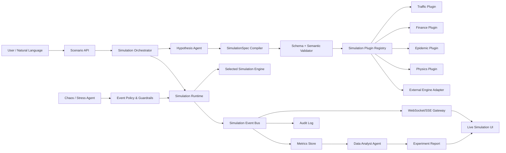
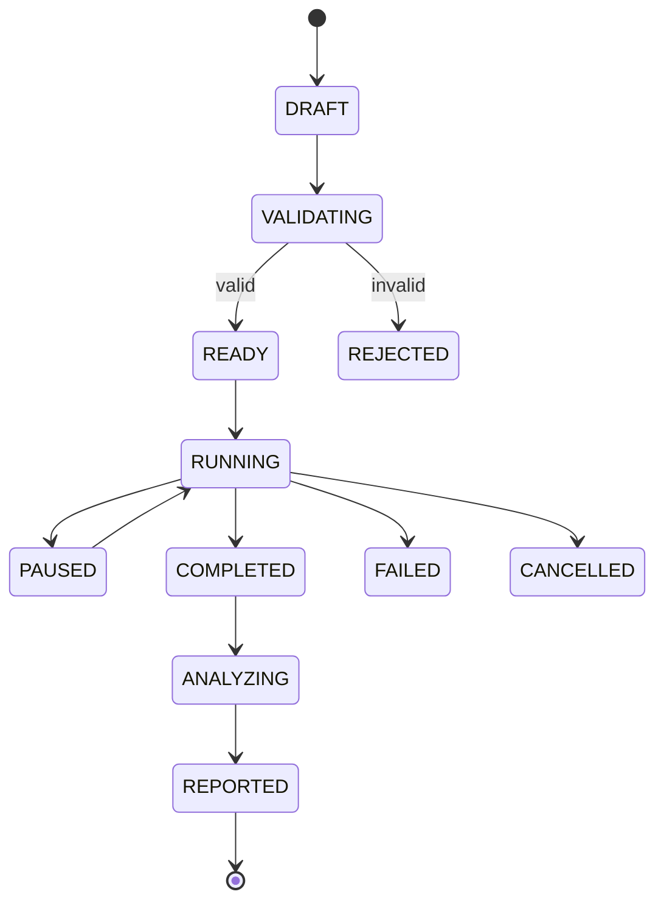
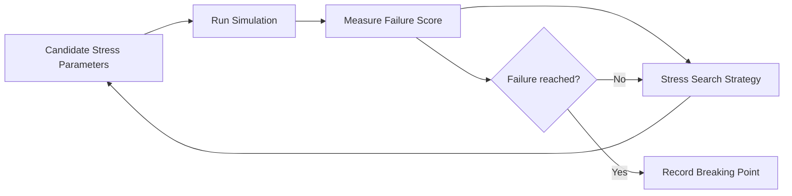
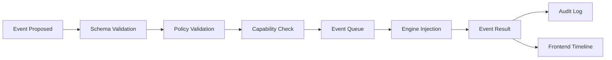
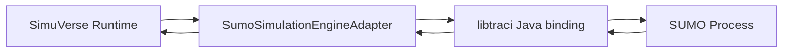

# SimuVerse AI — Modüler, Jenerik ve Ajan Destekli Simülasyon Platformu

> **Proje planı taslağı — Ağustos 2026**  
> Amaç: Kullanıcının doğal dille tanımladığı bir problemi, doğrulanabilir bir deney tanımına dönüştüren; uygun simülasyon motorunu seçen; güvenli biçimde stres olayları enjekte eden; sonuçları gerçek zamanlı görselleştirip analiz eden; yeni alanların eklenti gibi sisteme bağlanabildiği bir **AI Simulation Sandbox / Meta-Simulation Platform** geliştirmek.

---

## 0. Projenin Nihai Tanımı

**SimuVerse AI**, “LLM her şeyi kendi başına simüle eder” yaklaşımını değil, **LLM + deterministik simülasyon motorları + ajan orkestrasyonu + plugin mimarisi** birleşimini kullanır.

Kullanıcı örneğin:

> “Bir şehirde otonom araç oranı %10’dan %80’e çıktığında trafik yoğunluğu, ortalama yolculuk süresi ve kaza riskinin nasıl değişeceğini test et. Sonra yağmur ve sinyalizasyon arızası ekleyerek sistemi stres testine sok.”

şeklinde doğal dille bir senaryo verir.

Sistem bunu doğrudan “LLM tahmini” olarak cevaplamak yerine şu zincire dönüştürür:

1. Kullanıcının amacını çözümler.
2. Deney değişkenlerini, sabitleri, metrikleri ve sınırları çıkarır.
3. Senaryoyu tipli ve doğrulanabilir bir `SimulationSpec` nesnesine dönüştürür.
4. Uygun domain plugin’ini ve execution engine’i seçer.
5. Simülasyonu başlatır.
6. Simülasyon sırasında kontrollü “chaos/stress” olayları enjekte eder.
7. Her adımı ve metrikleri gerçek zamanlı olarak frontend’e aktarır.
8. Aynı deneyi farklı seed ve parametre kombinasyonlarıyla tekrarlar.
9. Baseline ve stresli koşulları karşılaştırır.
10. Data Analyst Agent deney sonucunu istatistiksel olarak yorumlar.
11. Kullanıcıya yalnızca “ne oldu?” değil, **“hangi koşulda, ne kadar güvenle, neden oldu?”** sorularını cevaplayan bir rapor sunar.

Bu nedenle SimuVerse AI’ın en doğru tanımı şudur:

> **Doğal dilden deney tanımı üreten, farklı simülasyon motorlarını tek bir sözleşme altında orkestre eden, kontrollü stres testleri uygulayan ve sonuçları açıklayan jenerik AI destekli deney platformu.**

---

# 1. En Önemli Mimari Düzeltme: “Her Şeyi Simüle Eden LLM” Olmamalı

Projenin vizyonu geniş olabilir; fakat akademik ve teknik olarak savunulabilir olması için kritik bir sınır konulmalıdır.

## 1.1 Yanlış yaklaşım

LLM’ye:

> “Faiz %10 artarsa ekonomi ne olur?”

sorup çıkan cevabı “simülasyon” olarak kabul etmek.

Bu yöntem:

- tekrar üretilebilir değildir,
- matematiksel olarak güvenilir değildir,
- domain kurallarını garanti etmez,
- rastgele LLM halüsinasyonlarını deney sonucu gibi gösterebilir,
- bilimsel doğrulama yapılamaz.

## 1.2 Doğru yaklaşım

LLM yalnızca şu görevlerde bulunmalıdır:

- doğal dili anlamak,
- değişkenleri çıkarmak,
- hipotez oluşturmak,
- uygun motoru seçmek,
- deney planlamak,
- izin verilen araçları çağırmak,
- sonuçları açıklamak.

Asıl sayısal hesaplama şunlardan biri tarafından yapılmalıdır:

- saf Java simülasyon motoru,
- discrete-event engine,
- agent-based model,
- graph/network modeli,
- Monte Carlo motoru,
- differential equation solver,
- cellular automata motoru,
- dış sistem adapter’ı (örn. SUMO),
- domain’e özel özel motor.

### Temel prensip

> **LLM = deney bilimcisi / orkestratör**  
> **Simulation Engine = hesaplama gerçekliği**

Bu ayrım projenin en güçlü akademik özelliklerinden biri olacaktır.

---

# 2. Projenin Ana Hedefleri

## 2.1 Fonksiyonel hedefler

SimuVerse AI şu kabiliyetleri sağlamalıdır:

1. Doğal dilden senaryo oluşturma.
2. Senaryoyu yapılandırılmış deney tanımına dönüştürme.
3. Deneyi başlamadan önce doğrulama.
4. Uygun simülasyon motorunu otomatik seçme.
5. Parametrelerin runtime sırasında değiştirilmesi.
6. Kontrollü chaos/stress olaylarının uygulanması.
7. Baseline ve perturbed run karşılaştırması.
8. Seed tabanlı tekrar üretilebilir deneyler.
9. Çoklu run / batch experiment çalıştırma.
10. Gerçek zamanlı grafik ve durum akışı.
11. Deney geçmişi ve replay.
12. Otomatik sonuç analizi.
13. Yeni domain’lerin plugin olarak eklenmesi.
14. Harici simülasyon motorlarının adapter üzerinden bağlanması.
15. Her ajan kararının ve motor müdahalesinin audit log’a yazılması.

## 2.2 Kalite hedefleri

Platform:

- deterministik olabilmeli,
- test edilebilir olmalı,
- yeniden üretilebilir olmalı,
- gözlemlenebilir olmalı,
- plugin eklenirken core kodu minimum değiştirmeli,
- hata durumunda simülasyonu güvenli şekilde durdurabilmeli,
- LLM’nin yetkisini sınırlamalı,
- farklı domain’lerde aynı orchestration katmanını yeniden kullanabilmelidir.

---

# 3. Kapsam Dışı Tutulması Gereken İddialar

İlk sürüm için şu iddialardan kaçınılmalıdır:

- “Dünyadaki herhangi bir olayı gerçeğe birebir simüle eder.”
- “LLM otomatik olarak bilimsel olarak doğru fizik motoru üretir.”
- “Plugin olmadan herhangi bir domain’i yüksek doğrulukla modelleyebilir.”
- “Simülasyon sonucu gerçek dünya tahmini olarak garanti edilir.”

Bunun yerine şu ürün vaadi kullanılmalıdır:

> “SimuVerse AI, **desteklenen domain motorları ve jenerik model primitive’leri** üzerinden doğal dille simülasyon oluşturmayı ve stres testi yapmayı kolaylaştırır.”

Bu ifade hem güçlü hem gerçekçidir.

---

# 4. Üst Seviye Sistem Mimarisi



---

# 5. SimuVerse AI İçin Katmanlı Mimari

Platformu aşağıdaki katmanlara ayırmak gerekir.

## Layer 1 — Presentation Layer

Sorumluluklar:

- doğal dil giriş ekranı,
- deney parametre editörü,
- canlı durum paneli,
- canlı grafikler,
- 2D grid / network görünümü,
- chaos event timeline,
- sonuç raporu,
- geçmiş deneyleri açma ve replay.

Teknoloji seçenekleri:

- Thymeleaf + vanilla JS başlangıç için,
- Chart.js hızlı grafik için,
- D3.js graph/network visualisation için,
- WebSocket/STOMP çift yönlü canlı kontrol için,
- SSE sadece server → client telemetri akışı gereken ekranlarda.

## Layer 2 — API / Application Layer

Sorumluluklar:

- experiment oluşturma,
- başlatma,
- durdurma,
- pause/resume,
- parametre update,
- event injection,
- rapor çağırma,
- experiment geçmişi.

## Layer 3 — Agent Orchestration Layer

Ajanlar:

- Hypothesis Agent
- Simulation Planner / Orchestrator
- Chaos/Stress Agent
- Critic / Validation Agent
- Data Analyst Agent

İleride:

- Calibration Agent
- Model Selection Agent
- Experiment Optimizer Agent
- Explanation Agent

## Layer 4 — Simulation Domain Layer

Domain bağımsız primitive’ler:

- simulation clock,
- state,
- entity,
- event,
- action,
- metric,
- constraint,
- parameter,
- random source,
- snapshot.

Domain plugin’leri:

- traffic,
- finance,
- epidemic,
- logistics,
- acoustic,
- generic cellular automata,
- graph diffusion.

## Layer 5 — Engine Adapter Layer

Aynı platform farklı execution backend’lerini çalıştırabilir:

- `InMemoryDiscreteEventEngine`
- `AgentBasedEngine`
- `CellularAutomataEngine`
- `MonteCarloEngine`
- `GraphSimulationEngine`
- `SumoTrafficAdapter`
- ileride Python microservice adapter’ı

## Layer 6 — Persistence / Observability

- PostgreSQL
- JSONB SimulationSpec saklama
- run / metric / event kayıtları
- audit trail
- Micrometer metrics
- structured logs

---

# 6. Projenin Kalbi: `SimulationSpec`

SimuVerse AI’ın bütün domain’leri aynı üst şemsiye altında birleştirmesini sağlayacak şey **rastgele JSON** değil, versiyonlanmış ve tipli bir deney sözleşmesidir.

Önerilen ana model:

```java
public record SimulationSpec(
        String specVersion,
        String domain,
        String engine,
        String title,
        String objective,
        Map<String, ParameterDefinition> parameters,
        List<EntityDefinition> entities,
        List<RuleDefinition> rules,
        List<MetricDefinition> metrics,
        List<ConstraintDefinition> constraints,
        List<StressEventDefinition> stressEvents,
        RunConfiguration runConfiguration
) {}
```

## 6.1 Örnek trafik SimulationSpec

```json
{
  "specVersion": "1.0",
  "domain": "traffic",
  "engine": "traffic-grid-v1",
  "title": "Autonomous Vehicle Penetration Stress Test",
  "objective": "Measure congestion and collision-risk sensitivity to AV penetration",
  "parameters": {
    "vehicleCount": {"type": "integer", "value": 1200, "min": 100, "max": 5000},
    "autonomousVehicleRatio": {"type": "double", "value": 0.10, "min": 0.0, "max": 1.0},
    "rainIntensity": {"type": "double", "value": 0.0, "min": 0.0, "max": 1.0}
  },
  "metrics": [
    {"name": "meanTravelTime", "unit": "seconds"},
    {"name": "meanSpeed", "unit": "km/h"},
    {"name": "congestionIndex", "unit": "ratio"},
    {"name": "nearCollisionCount", "unit": "count"}
  ],
  "stressEvents": [
    {
      "type": "WEATHER_RAIN",
      "triggerAtStep": 300,
      "payload": {"intensity": 0.8}
    }
  ],
  "runConfiguration": {
    "steps": 1800,
    "stepDurationSeconds": 1,
    "seed": 42001,
    "snapshotInterval": 10
  }
}
```

## 6.2 Neden bu kadar önemli?

Aynı Orchestrator şu alanlarla aynı şekilde konuşabilir:

- trafik,
- salgın,
- finans,
- lojistik,
- akustik.

Çünkü Orchestrator motorun iç algoritmasını bilmez. Yalnızca `SimulationSpec` üretir ve engine registry üzerinden uygun motoru bulur.

---

# 7. `SimulationState`: Tüm Motorların Ortak Runtime Dili

`SimulationSpec` deneyin **planıdır**.  
`SimulationState` ise deneyin **şu anki durumudur**.

```java
public record SimulationState(
        UUID runId,
        long step,
        double simulationTime,
        Map<String, Object> globalState,
        Map<String, EntityState> entities,
        Map<String, Double> metrics,
        List<ActiveEffect> activeEffects
) {}
```

State için önemli kurallar:

1. Domain state’i tamamen serbest `Map<String,Object>` olarak bırakılmamalı.
2. Core katmanda generic yapı bulunmalı.
3. Domain plugin kendi güçlü tiplerini tanımlayabilmeli.
4. Frontend’e gönderilecek DTO ile engine’in iç state objesi ayrılmalı.
5. Snapshot formatı versiyonlanmalıdır.

---

# 8. Simulation Engine Sözleşmesi

İlk taslaktaki `SimulationEngine` doğru yönde ancak daha güçlü hale getirilmelidir.

```java
public interface SimulationEngine {

    String engineId();

    EngineCapabilities capabilities();

    void initialize(SimulationSpec spec, SimulationRuntimeContext context);

    SimulationStepResult step();

    EventInjectionResult inject(SimulationEvent event);

    ParameterUpdateResult updateParameter(ParameterUpdate update);

    SimulationSnapshot snapshot();

    void restore(SimulationSnapshot snapshot);

    void stop();
}
```

## 8.1 `EngineCapabilities`

Engine’in hangi özellikleri desteklediğini ilan etmesini sağlar.

```java
public record EngineCapabilities(
        boolean supportsRealtimeMutation,
        boolean supportsSnapshots,
        boolean supportsReplay,
        boolean supportsBatchRuns,
        Set<String> supportedEventTypes,
        Set<String> supportedMetrics
) {}
```

Bu sayede ajan:

> “Sinyalizasyonu boz.”

komutunu kör biçimde motora yollamaz.

Önce motorun:

```text
TRAFFIC_LIGHT_FAILURE
```

event’ini destekleyip desteklemediğine bakılır.

---

# 9. Plugin Mimarisi

Yeni bir domain core projeyi değiştirmeden eklenebilmelidir.

Önerilen plugin sözleşmesi:

```java
public interface SimulationPlugin {

    String pluginId();

    String domain();

    PluginDescriptor descriptor();

    SimulationEngine createEngine();

    SimulationSpecValidator validator();

    DomainToolProvider toolProvider();

    MetricCatalog metricCatalog();

    StressEventCatalog stressEventCatalog();
}
```

## 9.1 Plugin Registry

```java
@Component
public class SimulationPluginRegistry {

    private final Map<String, SimulationPlugin> plugins;

    public SimulationPluginRegistry(List<SimulationPlugin> pluginList) {
        this.plugins = pluginList.stream()
                .collect(Collectors.toMap(
                        SimulationPlugin::domain,
                        Function.identity()
                ));
    }

    public SimulationPlugin getByDomain(String domain) {
        // validation + meaningful error
    }
}
```

Spring Dependency Injection sayesinde yeni `SimulationPlugin` bean’i eklendiğinde registry onu otomatik toplayabilir.

Ancak “auto-discovery” tek başına yeterli değildir. Plugin’in metadata’sı da tutulmalıdır.

## 9.2 Plugin Descriptor

Örnek:

```json
{
  "pluginId": "traffic-core",
  "domain": "traffic",
  "version": "1.0.0",
  "description": "Urban road traffic simulation",
  "engines": ["traffic-grid-v1", "sumo-adapter"],
  "supportedMetrics": [
    "meanSpeed",
    "meanTravelTime",
    "queueLength",
    "nearCollisionCount"
  ],
  "supportedEvents": [
    "WEATHER_RAIN",
    "ROAD_CLOSURE",
    "TRAFFIC_LIGHT_FAILURE"
  ]
}
```

---

# 10. İki Seviyeli Simülasyon Yaklaşımı

SimuVerse AI’ın hem kolay genişlemesi hem etkili sonuç üretmesi için iki tür motor desteklenmelidir.

## Level A — Generic Sandbox Engines

Hızlı prototipleme için:

- state transition,
- cellular automata,
- graph diffusion,
- queue simulation,
- Monte Carlo,
- basit agent-based modelling.

Avantaj:

- tamamen Java içinde çalışabilir,
- hızlı geliştirilebilir,
- demo için kolaydır,
- yeni fikir birkaç sınıfla eklenebilir.

Dezavantaj:

- yüksek gerçekçilik isteyen domain’lerde sınırlıdır.

## Level B — Domain-grade External Engines

Daha gerçekçi kullanım için adapter:

- trafik → SUMO,
- fizik → özel solver / dış fizik motoru,
- ağ/network → ns-3 adapter gibi harici servis,
- finans → özel order-book / stochastic model,
- akustik → DSP / room acoustics engine.

Böylece platform “tek Java motoru her şeyi çözer” gibi zorlayıcı bir sınıra takılmaz.

---

# 11. Ajan Mimarisi

Ajan sayısını artırmak projeyi otomatik olarak daha iyi yapmaz. Her ajan ayrı, ölçülebilir ve gerekçeli sorumluluğa sahip olmalıdır.

## 11.1 Hypothesis Agent

### Görevi

Kullanıcının doğal dil talebini bilimsel deney formuna dönüştürmek.

Çıktısı:

```java
public record HypothesisDraft(
        String researchQuestion,
        String hypothesis,
        List<String> independentVariables,
        List<String> dependentVariables,
        List<String> controlVariables,
        List<String> assumptions,
        List<String> requestedMetrics
) {}
```

### Örnek

Input:

> “Otonom araç oranı arttıkça trafik rahatlıyor mu?”

Output:

- Independent variable: autonomousVehicleRatio
- Dependent variables: meanTravelTime, congestionIndex
- Controls: vehicleCount, road topology, signal timing
- Hypothesis: increasing AV ratio reduces congestion after a threshold

### Kritik sınır

Hypothesis Agent **sonuç üretmez**.

Sadece deney tasarlar.

---

## 11.2 Simulation Orchestrator Agent

Sistemin ana koordinatörüdür.

Görevleri:

1. Hypothesis çıktısını alır.
2. Domain’i belirler.
3. Plugin Registry’den uygun plugin’i bulur.
4. `SimulationSpec` oluşturur.
5. Spec validation yaptırır.
6. Run oluşturur.
7. Engine’i initialize eder.
8. Simulation Scheduler’ı başlatır.
9. Chaos Agent ile event politikasını koordine eder.
10. Run tamamlanınca Data Analyst Agent’i tetikler.

### State machine



---

## 11.3 Chaos Monkey Agent → Daha Doğru Ad: Stress Injection Agent

“Chaos Monkey” sunum açısından akılda kalıcıdır. Ancak akademik dokümanda daha kontrollü isim tercih edilebilir:

> **Stress Injection Agent / Perturbation Agent**

Bu ajan rastgele her şeyi yapmamalıdır.

### Yanlış tasarım

LLM:

> “Canım istedi, araç hızını -500 yaptım.”

### Doğru tasarım

Ajan yalnızca `StressEventCatalog` tarafından tanımlı olaylardan seçim yapabilir.

Örnek:

```java
public enum TrafficStressEventType {
    WEATHER_RAIN,
    ROAD_CLOSURE,
    TRAFFIC_LIGHT_FAILURE,
    DEMAND_SURGE,
    EMERGENCY_VEHICLE
}
```

Her event’in:

- parametre aralığı,
- uygulanabilirlik koşulu,
- cooldown süresi,
- maksimum tekrar sayısı,
- severity sınırı

olmalıdır.

### Örnek policy

```json
{
  "eventType": "ROAD_CLOSURE",
  "maxSeverity": 0.5,
  "minStep": 120,
  "cooldownSteps": 300,
  "maxOccurrences": 2
}
```

### Stress agent modları

1. **Manual:** kullanıcı event seçer.
2. **Scheduled:** event planlı zamanda gerçekleşir.
3. **Random constrained:** seed tabanlı rastgele seçim.
4. **Adaptive:** ajan sistem zayıf görünüyorsa uygun event önerir.
5. **Adversarial search:** sistemin kırılma noktasını bulmaya çalışır.

En etkileyici ileri seviye özellik sonuncusudur.

---

# 12. Adversarial Stress Search

Chaos Agent’in yalnızca “rastgele yağmur yağdırması” yerine bilimsel değeri artırılabilir.

Amaç:

> Sistem hangi minimum perturbation seviyesinde belirlenen failure condition’a ulaşıyor?

Örneğin:

```text
Failure condition:
meanTravelTime > 900 seconds
```

Agent şu parametrelerde arama yapar:

- yağmur seviyesi,
- araç talebi,
- kapanan yol sayısı,
- sinyal arıza oranı.

Ajan bir optimization loop çalıştırabilir:



İlk sürüm:

- binary search,
- grid search,
- random search.

İleri sürüm:

- Bayesian optimization,
- evolutionary search,
- reinforcement learning.

Bu özellik projeye ciddi araştırma değeri katar.

---

# 13. Critic / Validation Agent

Ajan mimarisinde eksik kalabilecek kritik bileşendir.

Hypothesis Agent’in ürettiği deney planını çalıştırmadan önce sorgular.

Örnek kontroller:

- ölçmek istenen metrik engine tarafından destekleniyor mu?
- bağımsız değişken ile bağımlı değişken karışmış mı?
- parametre aralığı mantıklı mı?
- kullanıcı tek run üzerinden kesin sonuç istiyor mu?
- baseline eksik mi?
- deney süresi yeterli mi?
- event birbiriyle çelişiyor mu?

Critic çıktısı:

```json
{
  "valid": false,
  "issues": [
    {
      "severity": "ERROR",
      "field": "autonomousVehicleRatio",
      "message": "Value must be between 0 and 1"
    }
  ]
}
```

Ancak kritik yapı şudur:

> LLM critic + deterministic validator birlikte kullanılmalıdır.

LLM tek güvenlik katmanı olmamalıdır.

---

# 14. Data Analyst Agent

Data Analyst Agent ham veriye bakıp hikâye uydurmamalıdır.

Önce backend istatistik servisleri hesaplama yapar, sonra ajan bunları yorumlar.

## Backend’in hesaplaması gerekenler

- mean,
- median,
- standard deviation,
- percentiles,
- confidence interval,
- baseline delta,
- effect size,
- min/max,
- failure rate,
- threshold crossing point,
- correlation,
- mümkünse sensitivity score.

Ajanın görevi:

- sonuçları doğal dile çevirmek,
- en önemli kırılma noktalarını seçmek,
- anomali açıklaması yapmak,
- varsayımları hatırlatmak,
- “sonuç” ile “yorum”u ayırmak.

---

# 15. Spring AI Kullanım Stratejisi

Spring AI’ın rolü engine olmak değil, ajan ve tool orchestration katmanı olmalıdır.

Önerilen kullanım:

- `ChatClient`
- structured output → Java record / POJO
- tool calling
- Advisor katmanı
- gerekirse chat memory
- provider abstraction

## 15.1 Structured Output

Hypothesis Agent çıktısı serbest metin olmamalıdır.

Örnek:

```java
HypothesisDraft draft = chatClient.prompt()
        .system(hypothesisSystemPrompt)
        .user(userScenario)
        .call()
        .entity(HypothesisDraft.class);
```

Ardından Java Bean Validation uygulanır.

## 15.2 Tool Calling

Ajanlar doğrudan service method’larını çağırmak yerine izin verilen tool set’i üzerinden çalışabilir.

Örnek:

```java
@Component
public class SimulationControlTools {

    @Tool(description = "Pause the current simulation run")
    public ToolResult pauseSimulation(UUID runId) {
        // delegate to application service
    }

    @Tool(description = "Inject a validated stress event")
    public ToolResult injectStressEvent(
            UUID runId,
            String eventType,
            Map<String, Object> parameters
    ) {
        // policy validation -> runtime
    }
}
```

### Güvenlik kuralı

LLM tool callback → Application Service → Authorization/Validation → Engine

olmalıdır.

Şu yapıdan kaçınılmalıdır:

LLM → doğrudan engine internal method.

---

# 16. Simulation Runtime

`SimulationRuntime` core platformun LLM’den bağımsız en kritik servisidir.

Önerilen sorumluluklar:

- engine lifecycle,
- simulation clock,
- step scheduler,
- pause/resume,
- event queue,
- parameter update queue,
- snapshot,
- metric emission,
- run cancellation,
- exception isolation.

## 16.1 Deterministik simulation clock

Gerçek sistem saati ile simulation time ayrılmalıdır.

```text
Wall-clock time: 10:45:03
Simulation time: T = 12,540 seconds
Simulation step: 12,540
```

Bu sayede:

- simülasyon 10x hızlandırılabilir,
- pause yapılabilir,
- replay yapılabilir,
- batch run gerçek zaman beklemeden çalıştırılabilir.

---

# 17. Seed ve Reproducibility

Her run için seed tutulmalıdır.

```java
public record RunConfiguration(
        long maxSteps,
        double stepDuration,
        long seed,
        int snapshotInterval,
        ExecutionMode mode
) {}
```

Aynı:

- spec,
- engine version,
- plugin version,
- seed

ile deney mümkün olduğunca aynı sonucu üretmelidir.

Bu bilgi rapora da yazılmalıdır.

---

# 18. Event-Driven Simulation Core

Event modeli:

```java
public record SimulationEvent(
        UUID eventId,
        String type,
        long scheduledStep,
        String source,
        Map<String, Object> payload
) {}
```

`source` örnekleri:

- USER
- CHAOS_AGENT
- SCHEDULER
- ENGINE
- SYSTEM

Event lifecycle:



---

# 19. Gerçek Zamanlı Veri Akışı

## 19.1 WebSocket ne zaman?

Şunlar iki yönlü iletişim ister:

- pause,
- resume,
- parametre değişikliği,
- manual chaos injection,
- simülasyon hızını değiştirme.

Bu nedenle ana canlı kontrol kanalı için WebSocket/STOMP uygundur.

Örnek topic’ler:

```text
/topic/simulations/{runId}/state
/topic/simulations/{runId}/metrics
/topic/simulations/{runId}/events
/topic/simulations/{runId}/agents
```

Client komutları:

```text
/app/simulations/{runId}/pause
/app/simulations/{runId}/resume
/app/simulations/{runId}/parameters
/app/simulations/{runId}/events
```

## 19.2 SSE ne zaman?

Read-only ekranlar için daha basit olabilir:

- log stream,
- agent reasoning summary stream,
- metric feed,
- report progress.

MVP’de tek bir teknoloji seçmek istenirse **WebSocket/STOMP** daha kapsayıcıdır.

---

# 20. Frontend Simülasyon Ortamı

Frontend yalnızca grafik göstermemeli; “laboratuvar” hissi vermelidir.

## 20.1 Ana ekran düzeni

### Sol panel — Experiment Definition

- natural language scenario,
- selected domain,
- engine,
- variables,
- constraints,
- stress plan.

### Orta panel — Live World

Domain’e göre renderer değişir:

- traffic → road/grid/map,
- epidemic → 2D cellular grid,
- finance → price/order chart,
- acoustic → heatmap / frequency chart,
- logistics → graph/network.

### Sağ panel — Agent Activity

- Hypothesis generated
- Spec validated
- Simulation started
- Stress event proposed
- Stress event accepted/rejected
- Analyst detected threshold crossing

### Alt panel — Metrics Timeline

- Chart.js line charts,
- baseline vs stress,
- threshold markers,
- event markers.

---

# 21. Renderer Plugin Sistemi

Backend plugin kadar frontend renderer da modüler olmalıdır.

Örnek concept:

```javascript
const renderers = {
  traffic: TrafficRenderer,
  epidemic: EpidemicGridRenderer,
  finance: FinanceRenderer,
  genericGraph: GraphRenderer
};
```

Backend state payload:

```json
{
  "renderer": "traffic",
  "step": 120,
  "entities": [...],
  "metrics": {...}
}
```

Bu sayede yeni plugin eklendiğinde gerekiyorsa yalnızca yeni renderer eklenir.

---

# 22. Persistence Model

Önerilen PostgreSQL tabloları:

```text
users
simulation_projects
simulation_specs
simulation_runs
simulation_snapshots
simulation_events
simulation_metric_samples
simulation_reports
plugin_catalog
agent_actions
```

## 22.1 `simulation_runs`

Önemli alanlar:

```text
id
project_id
spec_id
engine_id
plugin_id
plugin_version
engine_version
seed
status
started_at
completed_at
failure_reason
```

## 22.2 JSONB kullanımı

Şunlar JSONB olabilir:

- spec payload,
- event payload,
- snapshot metadata,
- agent structured outputs.

Ancak yoğun metric time-series verisini tek dev JSON içine koymak yerine satır veya ayrı storage stratejisi kullanılmalıdır.

---

# 23. REST API Taslağı

```text
POST   /api/v1/projects
GET    /api/v1/projects/{projectId}

POST   /api/v1/simulations/interpret
POST   /api/v1/simulations/specs
GET    /api/v1/simulations/specs/{specId}
PUT    /api/v1/simulations/specs/{specId}

POST   /api/v1/simulations/runs
GET    /api/v1/simulations/runs/{runId}
POST   /api/v1/simulations/runs/{runId}/pause
POST   /api/v1/simulations/runs/{runId}/resume
POST   /api/v1/simulations/runs/{runId}/stop
POST   /api/v1/simulations/runs/{runId}/events
PATCH  /api/v1/simulations/runs/{runId}/parameters

GET    /api/v1/simulations/runs/{runId}/metrics
GET    /api/v1/simulations/runs/{runId}/events
GET    /api/v1/simulations/runs/{runId}/report

GET    /api/v1/plugins
GET    /api/v1/plugins/{pluginId}
```

---

# 24. Domain Plugin Örneği 1 — Trafik

İlk MVP için en iyi domain adayı **trafik / şehir simülasyonu**dur.

Neden?

- görsel olarak etkileyici,
- state kolay anlaşılır,
- agent’lar ve araçlar doğal olarak modellenebilir,
- stress event üretmek kolaydır,
- graph algoritmaları kullanılabilir,
- daha sonra SUMO ile gerçekçilik seviyesi artırılabilir.

## 24.1 MVP Traffic Engine

İlk motor dış bağımlılık olmadan basit Java model olabilir.

Road network:

```text
Node = intersection
Edge = road
```

JGraphT kullanılabilir.

Her road:

```java
public record RoadSegment(
        String id,
        String from,
        String to,
        double lengthMeters,
        double speedLimit,
        int capacity,
        boolean enabled
) {}
```

Vehicle:

```java
public record VehicleState(
        String vehicleId,
        boolean autonomous,
        String roadId,
        double position,
        double speed,
        String destination
) {}
```

## 24.2 Basit hareket modeli

Her tick:

1. hedef yol belirlenir,
2. yol yoğunluğu hesaplanır,
3. hız yoğunluğa göre düşürülür,
4. hava etkisi uygulanır,
5. araç konumu güncellenir,
6. intersection geçişi yapılır,
7. metric hesaplanır.

Bu model fiziksel olarak mükemmel olmak zorunda değildir; ilk amaç **platform mekanizmasını ispatlamak**tır.

## 24.3 Daha sonra SUMO adapter

İkinci trafik motoru:

```text
SumoSimulationEngineAdapter
```

Core platform değişmez.

Sadece engine implementation değişir.

Böylece sunumda çok güçlü bir karşılaştırma yapılabilir:

```text
traffic-grid-v1  -> hızlı, tamamen Java, öğretici
sumo-adapter     -> daha gerçekçi domain-grade traffic engine
```

---

# 25. Traffic MVP Metric Set

İlk sürümde:

- average speed,
- average travel time,
- queue length,
- throughput,
- congestion ratio,
- stopped vehicle count,
- near-collision proxy,
- route completion ratio.

Stress event’ler:

- rain,
- road closure,
- traffic light failure,
- demand surge,
- speed restriction,
- emergency vehicle priority.

---

# 26. Domain Plugin Örneği 2 — Salgın / Diffusion

Bu plugin, platformun “trafik motoruna özel yazılmadığını” göstermek için idealdir.

2D cellular automata veya graph diffusion kullanılabilir.

Entity state:

```text
SUSCEPTIBLE
INFECTED
RECOVERED
```

Parametreler:

- infectionProbability,
- recoveryProbability,
- mobility,
- populationDensity,
- vaccinationRatio.

Stress event:

- superspreader event,
- mobility surge,
- vaccination failure,
- quarantine.

Bu plugin’in değeri:

> Aynı Orchestrator + aynı SimulationSpec + aynı WebSocket + aynı Analyst sistemi, tamamen farklı domain’de çalışmış olur.

Bu, jeneriklik iddianızı kanıtlar.

---

# 27. Domain Plugin Örneği 3 — Finans

Finans plugin’i dikkatli tasarlanmalıdır.

Gerçek piyasa tahmini iddiası yerine:

> **synthetic market stress-testing sandbox**

olarak sunulmalıdır.

Model:

- synthetic agents,
- order book,
- buy/sell strategies,
- liquidity,
- volatility,
- market shock.

Metric’ler:

- portfolio drawdown,
- realized volatility,
- liquidity depth,
- spread,
- failure probability.

Chaos events:

- liquidity withdrawal,
- volatility spike,
- synthetic bank failure,
- rate shock.

---

# 28. Domain Plugin Örneği 4 — AcousticTwin

Akustik entegrasyonu “platform başka projeye nasıl bağlanıyor?” sorusuna güzel örnektir.

Fakat nem değişiminin ses davranışına etkisi gibi değerler gerçek fizik formülleri veya doğrulanmış DSP modeli üzerinden hesaplanmalıdır.

LLM yalnızca:

- deney kurar,
- değişkenleri belirler,
- stres event seçer,
- sonuçları yorumlar.

Engine:

- frequency response,
- attenuation,
- RT60,
- simplified propagation,
- DSP algorithms

hesaplar.

---

# 29. Plugin Entegrasyonu İçin “Capability-First” Yaklaşımı

Plugin’in yalnızca domain adı yeterli değildir.

Örneğin bir ajan şu işlemi isteyebilir:

> “Ortam nemini %20 artır.”

Sistemin soracağı sorular:

1. Aktif plugin humidity parametresi destekliyor mu?
2. Runtime mutation destekliyor mu?
3. Değer izin verilen aralıkta mı?
4. Event engine’in mevcut state’inde uygulanabilir mi?
5. Kullanıcının bu işlemi yapmaya yetkisi var mı?

Bu nedenle plugin tools için metadata gerekir.

```java
public record ToolCapability(
        String name,
        String description,
        JsonSchema inputSchema,
        RuntimePhase allowedPhase,
        RiskLevel riskLevel
) {}
```

---

# 30. Generic Model DSL — Çok Güçlü İleri Aşama

Projenin gerçekten “yeni senaryoları kolay ekleme” özelliğini güçlendirecek yapı, yalnızca Java plugin değil, küçük bir **Simulation DSL** olabilir.

Örneğin kullanıcı:

> “100 ajanın olduğu bir ortamda A durumundakiler her tur komşularını %15 ihtimalle B’ye dönüştürsün.”

LLM bunu şu primitive’lere çevirebilir:

```yaml
model:
  type: graph-agent
entities:
  agent:
    count: 100
    state:
      mode: [A, B]
rules:
  - when: agent.mode == A
    action:
      target: random_neighbor
      probability: 0.15
      set:
        mode: B
metrics:
  - count(mode == A)
  - count(mode == B)
```

Bu DSL daha sonra **Generic Agent-Based Engine** tarafından çalıştırılır.

## Önemli sınır

LLM’nin ürettiği DSL:

- schema validated,
- semantic validated,
- sandboxed,
- allowed operators ile sınırlı

olmalıdır.

LLM’nin runtime’da Java kodu üretip derlemesi MVP’de yapılmamalıdır.

---

# 31. Güvenlik ve Guardrail Mimarisi

LLM-controlled systems için kritik katmandır.

## 31.1 Tool authorization

Her tool çağrısı:

```text
Agent → Tool Gateway → Policy → Application Service → Engine
```

şeklinde geçmelidir.

## 31.2 Parametre sınırları

Örnek:

```text
rainIntensity: [0, 1]
vehicleCount: [1, 100000]
interestRateShock: [-0.5, +0.5]
```

## 31.3 Resource limits

Bir kullanıcı şu prompt’u verebilir:

> “10 milyar agent oluştur ve 10 milyon step çalıştır.”

Backend bunu reddetmelidir.

Limitler:

- max entities,
- max steps,
- max simultaneous runs,
- max memory,
- max wall-clock execution,
- max event injections.

## 31.4 Prompt injection isolation

Domain description içindeki metin, system prompt talimatı gibi yorumlanmamalıdır.

Tool ve engine izinleri kullanıcı prompt’u tarafından değiştirilememelidir.

---

# 32. Auditability

Her ajan aksiyonu kayıt altına alınmalıdır.

```java
public record AgentActionLog(
        UUID actionId,
        UUID runId,
        String agentName,
        String actionType,
        String toolName,
        Map<String, Object> arguments,
        String outcome,
        Instant timestamp
) {}
```

UI’da “Agent Timeline” gösterilebilir.

Örnek:

```text
12:04:10 HypothesisAgent  -> hypothesis created
12:04:12 Validator        -> spec accepted
12:04:13 Orchestrator     -> traffic-grid-v1 selected
12:04:30 StressAgent      -> WEATHER_RAIN proposed severity=0.7
12:04:30 PolicyGuard      -> accepted
12:05:02 Analyst          -> congestion threshold crossed
```

Bu özellik jüri sunumunda çok etkili olur.

---

# 33. Observability

Sistem metric’leri ile simulation metric’leri ayrılmalıdır.

## Platform metric’leri

- running simulations,
- simulation tick latency,
- event queue lag,
- WebSocket clients,
- LLM latency,
- tool-call latency,
- LLM token usage,
- failure count.

## Simulation metric’leri

- traffic congestion,
- infection count,
- price volatility,
- etc.

Micrometer + Spring Boot Actuator kullanılabilir.

---

# 34. Test Stratejisi

Bu proje test olmadan güvenilir görünmez.

## 34.1 Unit Tests

Test edilecek core bileşenler:

- SimulationSpec validator,
- plugin registry,
- event policy,
- simulation clock,
- metric calculator,
- seed reproducibility,
- state transitions.

## 34.2 Engine Contract Tests

Her engine aynı contract test suite’den geçirilmelidir.

Örneğin:

```java
abstract class SimulationEngineContractTest {
    abstract SimulationEngine engine();

    @Test
    void sameSeedShouldProduceSameResult() {}

    @Test
    void unsupportedEventShouldBeRejected() {}

    @Test
    void snapshotAndRestoreShouldPreserveState() {}
}
```

Yeni plugin yazan kişi bu testleri otomatik kazanır.

## 34.3 Agent Tests

LLM çıktısı için yalnızca exact string test edilmemelidir.

Test edilmesi gereken:

- JSON schema valid mi?
- required variable çıkmış mı?
- unknown metric uydurmuş mu?
- unsupported tool çağırmış mı?
- invalid domain seçmiş mi?

## 34.4 Integration Tests

Akış:

```text
Natural language
→ Hypothesis
→ Spec
→ Validation
→ Engine selection
→ Run
→ Metrics
→ Report
```

uçtan uca test edilmelidir.

## 34.5 WebSocket tests

- client subscribes,
- run starts,
- state event arrives,
- injected event appears,
- run completes.

## 34.6 Persistence tests

PostgreSQL için Testcontainers kullanılabilir.

---

# 35. Bilimsel Doğrulama / Model Validation

Bu projeyi sıradan demo olmaktan çıkaran bölüm budur.

Her domain için en az bir doğrulama stratejisi gerekir.

## Trafik

Basit engine’in çıktısı:

- beklenen queue davranışı,
- capacity arttığında throughput davranışı,
- demand arttığında congestion eğrisi

ile kontrol edilebilir.

İleri aşamada:

- SUMO benchmark ile karşılaştırma.

## Epidemic

Basit SIR modeline karşı trend karşılaştırması yapılabilir.

## Finance

Synthetic model olduğuna açıkça vurgu yapılmalı ve bilinen stochastic model davranışlarıyla kontrol edilmelidir.

---

# 36. Experiment Runner

Tek run yerine deney grubu kavramı eklenmelidir.

```java
public record ExperimentPlan(
        SimulationSpec baseSpec,
        List<ParameterSweep> sweeps,
        int repetitionsPerConfiguration
) {}
```

Örnek:

```text
AV ratio:
0.10
0.20
0.30
...
0.80

Her değer için 20 seed.
```

Bu durumda:

```text
8 configuration × 20 run = 160 simulation run
```

Data Analyst toplu sonucu analiz eder.

Bu, “tek demo run” yerine deneysel platform seviyesine geçiştir.

---

# 37. Parameter Sweep

Örnek:

```json
{
  "parameter": "autonomousVehicleRatio",
  "values": [0.1, 0.2, 0.3, 0.4, 0.5, 0.6, 0.7, 0.8]
}
```

İleri aşamada:

- range sweep,
- random sampling,
- Latin Hypercube,
- adaptive search.

---

# 38. Baseline ve Counterfactual Runs

Her stress test için mümkünse iki run tutulmalıdır.

### Baseline

Stress event yok.

### Counterfactual / Perturbed

Aynı seed ve başlangıç koşulu ile stress event var.

Sonra:

```text
Δ meanTravelTime
Δ throughput
Δ failure rate
```

hesaplanır.

Bu yapı Chaos Agent’in etkisini gerçekten ölçmenizi sağlar.

---

# 39. Replay Sistemi

Her UI frame’ini video olarak saklamak yerine:

- initial spec,
- seed,
- ordered events,
- parameter changes,
- periodic snapshots

saklanabilir.

Replay:

```text
Snapshot → apply events → advance engine
```

şeklinde yapılabilir.

UI’da timeline slider çok etkileyici olur.

---

# 40. Proje Paket Yapısı

Önerilen modular monolith başlangıç yapısı:

```text
src/main/java/com/simuverse/
│
├── SimuVerseApplication.java
│
├── common/
│   ├── exception/
│   ├── validation/
│   └── util/
│
├── project/
│   ├── controller/
│   ├── service/
│   ├── domain/
│   └── repository/
│
├── simulation/
│   ├── api/
│   │   ├── SimulationController.java
│   │   └── dto/
│   │
│   ├── core/
│   │   ├── SimulationEngine.java
│   │   ├── SimulationPlugin.java
│   │   ├── SimulationSpec.java
│   │   ├── SimulationState.java
│   │   ├── SimulationEvent.java
│   │   ├── SimulationSnapshot.java
│   │   └── EngineCapabilities.java
│   │
│   ├── runtime/
│   │   ├── SimulationRuntime.java
│   │   ├── SimulationScheduler.java
│   │   ├── SimulationClock.java
│   │   ├── EventQueue.java
│   │   └── RunManager.java
│   │
│   ├── registry/
│   │   ├── SimulationPluginRegistry.java
│   │   └── EngineRegistry.java
│   │
│   ├── validation/
│   │   ├── SimulationSpecValidator.java
│   │   ├── EventPolicyValidator.java
│   │   └── ResourceLimitValidator.java
│   │
│   ├── metric/
│   │   ├── MetricCollector.java
│   │   ├── MetricAggregator.java
│   │   └── ExperimentStatisticsService.java
│   │
│   └── persistence/
│       ├── entity/
│       └── repository/
│
├── agent/
│   ├── orchestrator/
│   ├── hypothesis/
│   ├── stress/
│   ├── critic/
│   ├── analyst/
│   ├── prompt/
│   ├── tool/
│   └── dto/
│
├── realtime/
│   ├── websocket/
│   ├── event/
│   └── dto/
│
├── plugin/
│   ├── traffic/
│   │   ├── TrafficPlugin.java
│   │   ├── engine/
│   │   ├── domain/
│   │   ├── metric/
│   │   ├── event/
│   │   └── tool/
│   │
│   ├── epidemic/
│   └── finance/
│
├── security/
├── audit/
└── config/
```

---

# 41. Neden Modular Monolith ile Başlanmalı?

İlk sürümde microservice mimarisine geçmek gereksiz karmaşıklık yaratır.

Modular monolith avantajları:

- tek deploy,
- hızlı debugging,
- transaction kolaylığı,
- sınırlar yine package/module ile korunabilir,
- plugin interface’i yine uygulanabilir.

Harici ağır engine gerektiğinde adapter microservice’e ayrılabilir.

Örneğin:

```text
SimuVerse Core
     |
     | REST/gRPC
     v
Python Physics Engine Service
```

Core en baştan microservice olmak zorunda değildir.

---

# 42. Teknoloji Yığını

## Backend

- Java 21
- Spring Boot 4.1.x
- Spring AI 2.0.x
- Spring MVC
- Spring WebSocket + STOMP
- Spring Security
- Spring Data JPA
- Bean Validation

## Database

- PostgreSQL
- Flyway

## Simulation / Math

İhtiyaca göre:

- Java standard math,
- Apache Commons Math / Commons Statistics / RNG,
- JGraphT,
- custom discrete-event scheduler,
- external SUMO adapter.

## Frontend

Başlangıç:

- Thymeleaf
- HTML/CSS/JS
- Chart.js

İleri görselleştirme:

- D3.js
- Canvas/WebGL tabanlı renderer gerekirse.

## Testing

- JUnit 5
- Mockito
- Spring Boot Test
- Testcontainers

## Observability

- Spring Boot Actuator
- Micrometer
- structured logs

---

# 43. Güncel Spring AI Uyum Notu

Ağustos 2026 itibarıyla Spring AI 2.0.x, Spring Boot 4.0.x ve 4.1.x’i desteklemektedir. Bu nedenle Java 21 + Spring Boot 4.1.x tabanlı bir SimuVerse backend’i ile Spring AI 2.0.x mimari olarak uyumludur.

Yine de proje oluşturulurken:

- Spring AI BOM,
- Spring Boot parent,
- seçilen model starter’ı

tek tek versiyon yazmak yerine uyumlu BOM üzerinden yönetilmelidir.

---

# 44. Geliştirme Yol Haritası — Faz Faz

Aşağıdaki plan, platformun “önce çalışması, sonra jenerikleşmesi, sonra zekileşmesi” prensibine göre hazırlanmıştır.

---

## FAZ 0 — Kapsamı ve Başarı Kriterlerini Sabitle

### Amaç

Projeyi “sonsuz senaryo” iddiasından çıkarıp ölçülebilir bir araştırma/ürün hedefi haline getirmek.

### Yapılacaklar

1. Ürün tanımını tek paragrafta sabitle.
2. İlk domain olarak Traffic seç.
3. İkinci jeneriklik kanıtı olarak Epidemic seç.
4. İlk motor olarak pure Java traffic-grid / graph engine belirle.
5. “LLM numerical engine değildir” mimari kuralını belgeye yaz.
6. Minimum başarı kriterlerini belirle.

### Definition of Done

Aşağıdaki demo çalışabiliyorsa proje temel vizyonunu kanıtlamış sayılır:

- doğal dille trafik senaryosu girilir,
- structured spec oluşur,
- traffic engine seçilir,
- simülasyon canlı başlar,
- yağmur event’i enjekte edilir,
- grafik değişir,
- run tamamlanır,
- analyst baseline ile farkı raporlar.

---

## FAZ 1 — Proje İskeleti ve Altyapı

### Amaç

Temiz Spring Boot temelini oluşturmak.

### Yapılacaklar

1. Spring Boot 4.1.x + Java 21 proje oluştur.
2. Maven dependency management ayarla.
3. PostgreSQL Docker Compose ekle.
4. Flyway ekle.
5. temel environment config oluştur.
6. exception handling yapısı ekle.
7. CI pipeline oluştur.
8. test profile hazırla.

### Çıktı

Sağlıklı çalışan backend + database + test pipeline.

---

## FAZ 2 — Core Simulation Domain Model

### Amaç

AI eklemeden önce simülasyon platformunun domain dilini kurmak.

### Oluşturulacak yapılar

- `SimulationSpec`
- `SimulationState`
- `SimulationEvent`
- `SimulationSnapshot`
- `SimulationStepResult`
- `MetricDefinition`
- `ParameterDefinition`
- `ConstraintDefinition`
- `RunConfiguration`
- `EngineCapabilities`

### Kritik testler

- invalid parameter rejected,
- invalid spec rejected,
- unknown metric rejected,
- unknown event rejected.

### Çıktı

Henüz LLM olmadan elle oluşturulan `SimulationSpec` Java objesi validate edilebiliyor.

---

## FAZ 3 — Simulation Engine Runtime

### Amaç

Simülasyonu gerçekten çalıştırabilecek domain bağımsız runtime oluşturmak.

### Yapılacaklar

1. `SimulationEngine` interface.
2. `SimulationRuntime`.
3. `SimulationClock`.
4. `RunManager`.
5. `EventQueue`.
6. pause/resume.
7. stop.
8. parameter update queue.
9. snapshot/replay temel yapısı.
10. deterministic seed.

### Test

Mock engine ile:

```text
initialize → step x100 → pause → resume → event → complete
```

akışı test edilir.

### Çıktı

AI olmadan generic engine lifecycle hazırdır.

---

## FAZ 4 — Plugin Registry

### Amaç

Yeni domain eklemenin core kodu değiştirmemesini sağlamak.

### Yapılacaklar

- `SimulationPlugin`
- `SimulationPluginRegistry`
- `PluginDescriptor`
- `MetricCatalog`
- `StressEventCatalog`
- `DomainToolProvider`

### Test

İki fake plugin ekle:

```text
traffic
mock-epidemic
```

Registry ikisini otomatik keşfetmeli.

### Çıktı

Platform artık domain-plugin mimarisine sahiptir.

---

## FAZ 5 — İlk Gerçek Motor: Traffic Grid / Graph Engine

### Amaç

Platformun ilk çalışan dünyasını oluşturmak.

### Adımlar

1. Road graph modelle.
2. intersection modelle.
3. vehicle entity modelle.
4. route selection ekle.
5. road capacity ekle.
6. basic speed-density ilişkisi ekle.
7. traffic signal state ekle.
8. metric collector ekle.
9. rain effect ekle.
10. road closure event ekle.

### İlk metric set

- average speed,
- average travel time,
- throughput,
- congestion ratio,
- queued vehicle count.

### Çıktı

Java içinde tamamen çalışan ilk simülasyon.

---

## FAZ 6 — Persistence

### Amaç

Deneylerin kaydedilmesi ve tekrar açılması.

### Yapılacaklar

Flyway migrations:

1. `simulation_projects`
2. `simulation_specs`
3. `simulation_runs`
4. `simulation_events`
5. `simulation_metric_samples`
6. `simulation_reports`
7. `agent_actions`

### Çıktı

Run geçmişi kaybolmaz.

---

## FAZ 7 — Live WebSocket Pipeline

### Amaç

Simülasyonu tarayıcıda canlı göstermek.

### Yapılacaklar

1. WebSocket config.
2. run-specific topic.
3. state DTO.
4. metric DTO.
5. event DTO.
6. WebSocket publisher.
7. frontend subscription.
8. pause/resume komutları.
9. manual stress event.

### İlk UI

- Run button
- Pause
- Resume
- Rain Inject
- metric line chart
- event timeline
- simple 2D traffic grid

### Çıktı

Sunumda ilk “wow” anı burada oluşur.

---

## FAZ 8 — Spring AI + Hypothesis Agent

### Amaç

Kullanıcının doğal dilini yapılandırılmış deney planına dönüştürmek.

### Adımlar

1. Spring AI ekle.
2. `ChatClient` yapılandır.
3. Hypothesis Agent system prompt yaz.
4. `HypothesisDraft` structured output kullan.
5. Bean Validation uygula.
6. unit/evaluation dataset oluştur.

### Örnek test input’ları

- açık senaryo,
- eksik parametreli senaryo,
- saçma parametre,
- unsupported domain,
- ambiguity.

### Çıktı

Natural language → HypothesisDraft.

---

## FAZ 9 — SimulationSpec Compiler Agent

### Amaç

Hypothesis’ten engine-ready SimulationSpec üretmek.

Bu aşamada Agent + deterministic catalog birlikte çalışır.

### Akış

```text
HypothesisDraft
→ plugin capabilities
→ metric catalog
→ event catalog
→ prompt
→ SimulationSpec candidate
→ deterministic validation
```

### Kritik kural

LLM plugin tarafından desteklenmeyen metric veya event oluşturursa spec rejected edilir veya düzeltilir.

### Çıktı

Natural language → runnable SimulationSpec.

---

## FAZ 10 — Simulation Orchestrator

### Amaç

Bütün workflow’u tek state machine üzerinden bağlamak.

### Akış

```text
Interpret
→ Hypothesis
→ Select Plugin
→ Compile Spec
→ Validate
→ Create Run
→ Start Engine
→ Stream State
→ Complete
→ Analyze
```

### Çıktı

Kullanıcı tek butonla doğal dilden simülasyon başlatabilir.

---

## FAZ 11 — Stress Injection Agent

### Amaç

Kontrollü, ölçülebilir chaos testleri.

### İlk versiyon

Ajan:

- yalnızca catalog event seçebilir,
- severity belirleyebilir,
- zamanlama önerebilir.

Policy katmanı:

- izin kontrolü,
- limit,
- cooldown,
- engine capability

uygular.

### Çıktı

Agent-driven fakat kontrolsüz olmayan stress testing.

---

## FAZ 12 — Experiment Runner + Baseline Comparison

### Amaç

Tek run’dan gerçek deney platformuna geçmek.

### Yapılacaklar

- experiment plan,
- parameter sweep,
- multi-seed repetitions,
- baseline,
- perturbed run,
- aggregate statistics.

### Çıktı

Örneğin AV ratio 0.1–0.8 arasında 160 run otomatik çalıştırılabilir.

---

## FAZ 13 — Data Analyst Agent

### Amaç

İstatistik sonuçlarını açıklanabilir rapora dönüştürmek.

### Backend önce hesaplar

- descriptive statistics,
- delta,
- confidence intervals,
- threshold crossings,
- failure rate.

### Agent sonra üretir

- summary,
- key findings,
- anomalies,
- assumptions,
- limitations,
- recommended next experiments.

### Çıktı

Jüriye sunulabilir otomatik deney raporu.

---

## FAZ 14 — İkinci Domain Plugin: Epidemic

### Amaç

Jeneriklik iddiasını gerçek olarak kanıtlamak.

Core agent koduna dokunmadan:

- epidemic plugin,
- grid engine,
- infection metrics,
- epidemic stress events,
- renderer

eklenir.

### Başarı kriteri

Orchestrator’daki ana workflow class’larında domain-specific `if (traffic)` benzeri kod olmamalıdır.

---

## FAZ 15 — External Engine Adapter: SUMO

### Amaç

Platformun yalnızca “oyuncak Java simülasyonu” olmadığını göstermek.

### Mimari



### Yapılacaklar

1. SUMO process lifecycle yönetimi.
2. network/config input.
3. `step()` mapping.
4. vehicle metric mapping.
5. road closure event mapping.
6. traffic signal event mapping.
7. snapshot limitation handling.
8. engine capability metadata.

### Çıktı

Aynı UI ve ajanlar farklı traffic engine ile çalışır.

---

## FAZ 16 — Adversarial Stress Search

### Amaç

Sistem kırılma noktasını otomatik bulsun.

İlk algoritma:

- threshold objective,
- grid search,
- binary search.

Örnek:

> “Congestion index 0.8’i aşana kadar demand surge seviyesini artır.”

Çıktı:

```text
Critical demand multiplier = 1.67 ± 0.08
```

Bu faz araştırma değerini ciddi biçimde yükseltir.

---

## FAZ 17 — Replay, Versioning ve Experiment Provenance

### Amaç

Sonucun nasıl üretildiğini geriye dönük ispatlayabilmek.

Kaydedilecekler:

- user prompt,
- normalized hypothesis,
- SimulationSpec,
- plugin version,
- engine version,
- model/provider metadata,
- seed,
- events,
- tool calls,
- final metrics.

### Çıktı

“Bu sonuç nereden çıktı?” sorusu cevaplanabilir.

---

## FAZ 18 — UX ve Sunum Seviyesi İyileştirmeler

### Özellikler

- experiment wizard,
- scenario templates,
- domain selector,
- live agent cards,
- simulation speed control,
- timeline scrubber,
- compare runs,
- report export,
- metric overlays.

---

# 45. Önerilen Minimum MVP

Bitirme projesinde kapsamın dağılmaması için Minimum Viable Thesis / Product:

## Core

- SimulationSpec
- SimulationState
- SimulationEngine
- Plugin Registry
- Simulation Runtime
- Event system
- metric system

## AI

- Hypothesis Agent
- Orchestrator
- Stress Agent
- Analyst Agent

## Domain

- Traffic plugin
- Epidemic plugin

## Realtime

- WebSocket
- live metric chart
- live 2D renderer
- event timeline

## Experiment

- seed
- baseline
- stress run
- multi-run comparison

Bu kadarının iyi yapılması, beş yarım domain yapmaktan daha değerlidir.

---

# 46. İdeal “V1 / V2 / V3” Bölünmesi

## V1 — Working Sandbox

- manual SimulationSpec,
- traffic engine,
- live UI,
- manual event injection.

## V2 — Agentic Sandbox

- natural language,
- Hypothesis Agent,
- Orchestrator,
- Stress Agent,
- Analyst.

## V3 — Meta-Simulation Platform

- second domain,
- plugin SDK,
- external engine adapter,
- multi-run experiments,
- adversarial stress search.

---

# 47. Akademik Katkı Nasıl Güçlendirilir?

Sadece “LLM + simülasyon yaptık” akademik katkı olarak zayıf kalabilir.

Aşağıdaki araştırma eksenlerinden en az biri seçilmelidir.

## Seçenek A — Natural Language to Simulation Specification

Araştırma sorusu:

> LLM tabanlı multi-agent orchestration, doğal dilde tanımlanan deneyleri ne ölçüde geçerli ve çalıştırılabilir bir simulation specification’a dönüştürebilir?

Metric:

- valid spec rate,
- parameter extraction accuracy,
- unsupported capability hallucination rate,
- correction count.

## Seçenek B — Agentic Stress Testing

Araştırma sorusu:

> Adaptif adversarial stress agent, random perturbation yaklaşımına kıyasla sistemin kritik kırılma noktalarını daha az deneyle bulabilir mi?

Karşılaştırma:

- random search,
- grid search,
- agent-guided search.

Metric:

- runs to failure discovery,
- cost,
- found severity threshold.

## Seçenek C — Cross-Domain Generality

Araştırma sorusu:

> Ortak SimulationSpec ve capability tabanlı plugin mimarisi, domain’e özel orchestration kodunu ne ölçüde azaltabilir?

Metric:

- reused core code ratio,
- plugin LOC,
- number of core modifications required,
- integration time.

## En güçlü birleşim

A + B + küçük ölçekte C.

---

# 48. Ölçülebilir Proje Metrikleri

Teknik kalite için:

- Spec validation success rate
- Agent invalid-tool-call rate
- Simulation reproducibility rate
- Mean tick execution time
- WebSocket event latency
- Engine failure recovery rate
- Plugin integration effort
- Number of core changes per plugin

Araştırma için:

- hypothesis extraction accuracy
- simulation configuration accuracy
- critical threshold discovery efficiency
- analyst explanation faithfulness

---

# 49. Riskler ve Önlemler

| Risk | Etki | Önlem |
|---|---:|---|
| “Her şeyi simüle eder” kapsamı kontrolden çıkar | Çok yüksek | İlk iki domain’i sabitle |
| LLM yanlış spec üretir | Yüksek | Structured output + deterministic validation |
| Chaos Agent anlamsız event üretir | Yüksek | Event catalog + policy guard |
| Simülasyon yavaşlar | Orta/Yüksek | batch mode + event throttling + sampling |
| Frontend çok karmaşıklaşır | Orta | domain renderer interface |
| Çok fazla ajan eklenir | Orta | her ajana ölçülebilir tek sorumluluk |
| External engine entegrasyonu gecikir | Orta | V1 pure Java engine ile tamamlanabilir olsun |
| Sonuçlar bilimsel gerçek gibi sunulur | Yüksek | model assumptions + validation + limitations raporu |
| LLM maliyeti artar | Orta | run tick’lerinde LLM çağırma; event bazlı çağır |

---

# 50. Çok Önemli Performans Prensibi

LLM **her simulation tick’inde çağrılmamalıdır**.

Yanlış:

```text
step 1 → LLM
step 2 → LLM
step 3 → LLM
...
```

Doğru:

LLM sadece:

- experiment planning,
- major state checkpoints,
- stress decision moments,
- analysis

sırasında çağrılmalıdır.

Engine binlerce tick’i kendi başına çalıştırır.

Bu yaklaşım:

- latency,
- maliyet,
- determinism,
- scalability

bakımından çok daha iyidir.

---

# 51. Event Trigger Modeli

Stress Agent sürekli polling yapmak yerine event-triggered olabilir.

Örnek trigger:

```text
metric.congestionIndex > 0.65
```

veya:

```text
step == 300
```

veya:

```text
metric.meanSpeed drops 20% in 30 steps
```

Trigger engine deterministic olarak evaluate eder.

Ajan yalnızca trigger sonrası müdahale seçer.

---

# 52. Scenario Template Sistemi

Kullanıcıların sıfırdan prompt yazması zorunlu olmamalıdır.

Template örnekleri:

### Traffic Resilience

```text
Test how [parameter] affects congestion under [stress event].
```

### Epidemic Intervention

```text
Compare [intervention A] vs [intervention B] under equal initial conditions.
```

### Supply Chain Disruption

```text
Measure delivery performance after failure of [node/route].
```

Template kullanıcıdan gerekli alanları toplar, LLM ise eksik bağlamı normalize eder.

---

# 53. “Yeni Bir Proje Nasıl SimuVerse’e Takılır?” Akışı

Örneğin ekip daha sonra LogisticsTwin geliştirdi.

SimuVerse’e entegrasyon adımları:

1. `SimulationPlugin` implement edilir.
2. `LogisticsSimulationEngine` yazılır veya mevcut engine adapter edilir.
3. Parametre şeması tanımlanır.
4. Metric catalog tanımlanır.
5. Stress event catalog tanımlanır.
6. Agent tool’ları gerekiyorsa eklenir.
7. Plugin descriptor eklenir.
8. Contract test suite çalıştırılır.
9. Frontend renderer eklenir.
10. Registry plugin’i otomatik keşfeder.

Core Orchestrator’ın değiştirilmemesi hedeflenir.

Bu, projenin ana “platform” başarısıdır.

---

# 54. Plugin SDK Hedefi

İleri aşamada ayrı bir modül çıkarılabilir:

```text
simuverse-plugin-sdk
```

İçeriği:

- interfaces,
- annotations,
- DTOs,
- validation helpers,
- contract tests,
- sample plugin.

Böylece başka ekip üyesi SimuVerse core repo’suna dokunmadan plugin yazabilir.

---

# 55. Örnek Uçtan Uca Demo Senaryosu

## Kullanıcı

> “2.000 aracın olduğu 5x5 grid şehirde otonom araç oranını %20’den %80’e çıkar. Her oran için 10 tekrar çalıştır. 10. dakikada şiddetli yağmur başlasın ve iki ana kavşaktan birinin sinyalizasyonu bozulsun. Ortalama yolculuk süresinin hangi AV oranında en düşük olduğunu ve sistemin hangi koşulda darboğaza girdiğini bul.”

## Sistem

### 1. Hypothesis Agent

```text
Independent variable: autonomousVehicleRatio
Dependent: meanTravelTime, throughput, congestionIndex
Stressors: rain, signal failure
```

### 2. Spec Compiler

AV sweep:

```text
0.2, 0.3, 0.4, 0.5, 0.6, 0.7, 0.8
```

### 3. Experiment Runner

```text
7 × 10 = 70 baseline/stress configurations
```

### 4. Runtime

WebSocket üzerinden canlı durum gönderilir.

### 5. Stress Agent

10. dakikada önceden doğrulanmış event’leri uygular.

### 6. Analyst

Örnek çıktı formatı:

```text
Best observed AV ratio: 0.70
Mean travel-time improvement vs 0.20 baseline: 18.4%
Primary failure trigger: combined rain + signal failure
Critical congestion threshold first reached at demand multiplier: 1.58
```

### 7. UI

- map/grid,
- line chart,
- event markers,
- compare baseline,
- agent timeline,
- final report.

Bu demo tek başına projenin bütün temel özelliklerini gösterir.

---

# 56. Jüri Sunumundaki Teknik Hikâye

Projenin anlatımı şu sırada yapılmalıdır:

1. “Doğal dil ile simülasyon kurmak zor.”
2. “LLM tek başına simülasyon motoru olarak güvenilir değil.”
3. “Biz LLM’yi orchestration katmanında kullandık.”
4. “SimulationSpec ile natural language ve deterministic engine arasına contract koyduk.”
5. “Plugin mimarisiyle domain’leri ayrıştırdık.”
6. “Stress Agent ile canlı perturbation yaptık.”
7. “Baseline/counterfactual ile etkisini ölçtük.”
8. “Aynı platformu iki farklı domain’de gösterdik.”
9. “External SUMO adapter ile domain-grade engine entegrasyonunu gösterdik.”
10. “Her run seed, spec, event ve engine version ile yeniden üretilebilir.”

Bu anlatı yalnızca “AI kullandık” demekten çok daha güçlüdür.

---

# 57. Mimari Anti-Pattern’ler

Aşağıdakiler yapılmamalıdır.

## Anti-pattern 1

Her domain için ayrı Orchestrator yazmak.

```text
TrafficOrchestrator
FinanceOrchestrator
MusicOrchestrator
```

Bunun yerine:

```text
SimulationOrchestrator + Plugin Capability
```

## Anti-pattern 2

`if/else` ile domain seçmek.

```java
if (domain.equals("traffic")) {...}
else if (domain.equals("finance")) {...}
```

Registry kullan.

## Anti-pattern 3

LLM’nin arbitrary Java kod üretip backend’de çalıştırması.

Güvenlik ve stabilite açısından MVP’de kaçınılmalıdır.

## Anti-pattern 4

Her state’i `Map<String,Object>` yapmak.

Core generic olabilir ama domain modelleri güçlü tip kullanmalıdır.

## Anti-pattern 5

Her tick LLM çağrısı.

Engine hesaplar; agent checkpoint’lerde karar verir.

## Anti-pattern 6

Stress event’in sonucunu LLM’ye hesaplatmak.

Event sadece state mutation command üretir; sonuç engine’den gelir.

---

# 58. Projenin “Etkileyici” Olmasını Sağlayacak Özellikler — Öncelik Sırasıyla

1. **Natural language → live simulation**
2. **Agent timeline**
3. **Real-time chaos injection**
4. **Baseline vs stressed comparison**
5. **Replay timeline**
6. **Parameter sweep**
7. **Automatic breaking-point search**
8. **Second domain plugin without core modification**
9. **SUMO adapter**
10. **Auto-generated experiment report**

İlk 5 bile çok güçlü bir demo çıkarır.

---

# 59. Geliştirme Önceliği

Teknik olarak tavsiye edilen sıra:

```text
Simulation Core
↓
Traffic Engine
↓
Live UI
↓
Manual Stress Events
↓
Plugin Registry
↓
Hypothesis Agent
↓
Spec Compiler
↓
Orchestrator
↓
Stress Agent
↓
Experiment Runner
↓
Analyst
↓
Second Domain
↓
SUMO Adapter
↓
Adversarial Search
```

AI ile başlamamak özellikle önemlidir.

Önce simülasyon sistemi güvenilir olmalıdır.

---

# 60. Önerilen 16 Haftalık Çalışma Taslağı

| Hafta | Hedef |
|---|---|
| 1 | Gereksinimler, architecture decision records, project setup |
| 2 | SimulationSpec + core domain + validators |
| 3 | SimulationRuntime + clock + event queue |
| 4 | Plugin registry + fake engine contract tests |
| 5 | Traffic graph/entity modeli |
| 6 | Traffic metrics + events |
| 7 | PostgreSQL persistence + run history |
| 8 | WebSocket + live metric UI |
| 9 | Traffic 2D renderer + manual stress controls |
| 10 | Spring AI + Hypothesis Agent |
| 11 | Spec Compiler + Orchestrator |
| 12 | Stress Agent + policy guard |
| 13 | Experiment runner + baseline comparison |
| 14 | Analyst + report |
| 15 | Epidemic plugin / genericity validation |
| 16 | polishing, benchmark, demo, documentation |

### Stretch hedefler

- SUMO adapter,
- adversarial threshold search,
- plugin SDK,
- replay slider.

---

# 61. Eğer Süre Daha Uzunsa: 6 Aylık Plan

## Ay 1

Core architecture + Traffic engine.

## Ay 2

Realtime UI + persistence + manual experiments.

## Ay 3

AI agents + structured spec compilation.

## Ay 4

Experiment runner + stress search + statistics.

## Ay 5

Second domain + external engine integration.

## Ay 6

Evaluation, research experiments, report, demo hardening.

---

# 62. İlk Kodlanması Gereken Sınıflar

En doğru başlangıç sırası:

```text
1. SimulationSpec
2. ParameterDefinition
3. MetricDefinition
4. SimulationEvent
5. RunConfiguration
6. SimulationState
7. SimulationStepResult
8. EngineCapabilities
9. SimulationEngine
10. SimulationPlugin
11. SimulationPluginRegistry
12. SimulationClock
13. EventQueue
14. SimulationRuntime
15. FakeSimulationEngine
16. Contract tests
```

Bunlar tamamlanmadan Hypothesis Agent yazılmamalıdır.

---

# 63. İlk Teknik Proof-of-Concept

İlk PoC’de yalnızca şu akış yapılmalıdır:

```text
Manual JSON SimulationSpec
↓
Traffic Plugin
↓
Traffic Engine initialize
↓
1000 simulation step
↓
step 300 → rain event
↓
metrics console output
↓
final summary
```

Bu çalıştıktan sonra WebSocket eklenir.

Sonra LLM eklenir.

Bu sıra debug maliyetini dramatik biçimde azaltır.

---

# 64. Definition of Done — Core Platform

Core platform tamamlanmış sayılırsa:

- [ ] Engine interface domain bağımsızdır.
- [ ] İki farklı plugin registry üzerinden yüklenir.
- [ ] SimulationSpec schema validated edilir.
- [ ] Simulation aynı seed ile tekrarlanabilir.
- [ ] Runtime pause/resume destekler.
- [ ] Event injection audit log’a düşer.
- [ ] Metric streaming çalışır.
- [ ] Unsupported event güvenli şekilde reddedilir.
- [ ] Bir plugin core Orchestrator değiştirilmeden eklenebilir.

---

# 65. Definition of Done — Agent Layer

- [ ] Hypothesis Agent structured output üretir.
- [ ] Invalid output validator tarafından yakalanır.
- [ ] Orchestrator plugin capability’ye göre engine seçer.
- [ ] Agent’ın unsupported tool çağrısı çalıştırılmaz.
- [ ] Stress Agent yalnızca catalog event kullanır.
- [ ] Analyst yalnızca backend tarafından hesaplanan metric’lerden rapor üretir.
- [ ] Agent actions audit edilebilir.

---

# 66. Definition of Done — Demo

- [ ] Kullanıcı doğal dil prompt girer.
- [ ] Sistem deney planını UI’da gösterir.
- [ ] Kullanıcı Run’a basar.
- [ ] Simülasyon canlı akar.
- [ ] Grafikler gerçek zamanlı değişir.
- [ ] Stress event timeline’da belirir.
- [ ] Baseline karşılaştırması gösterilir.
- [ ] Final report otomatik çıkar.
- [ ] Aynı sistem farklı domain’de tekrar gösterilebilir.

---

# 67. Araştırma Deneyi Taslağı

Bitirme tezinde değerlendirilebilecek örnek deney:

## RQ1

Natural-language-to-SimulationSpec pipeline ne kadar güvenilir?

### Dataset

50–100 senaryo prompt’u.

### Metric

- valid spec rate,
- correct domain rate,
- correct metric selection,
- parameter extraction F1,
- unsupported capability hallucination.

## RQ2

Adversarial Stress Agent random chaos’a göre kırılma noktasını daha verimli buluyor mu?

### Test

10 farklı trafik senaryosu.

### Baseline

Random stress sampling.

### Proposed

Agent-guided / threshold-guided search.

### Metric

- simulations required to discover failure,
- discovered minimum stress severity,
- compute cost.

## RQ3

Plugin architecture gerçekten jenerik mi?

### Karşılaştırma

Traffic → Epidemic plugin eklenmesi.

### Metric

- core modified LOC,
- reused service ratio,
- integration effort.

---

# 68. Projenin Güçlü Nihai Formu

En başarılı SimuVerse AI şu dört özelliği aynı anda göstermelidir:

### 1. Natural Language Experimentation

Kullanıcı deney kodu yazmak zorunda değildir.

### 2. Deterministic Simulation Runtime

LLM sonucu uydurmaz; gerçek engine hesaplar.

### 3. Agentic Stress Testing

Ajanlar yalnızca gözlemlemez, kontrollü şekilde deney tasarlar ve sistemi zorlar.

### 4. Cross-Domain Plugin Architecture

Aynı core platform farklı dünyalara bağlanır.

Bu dört bileşenin birleşimi projenin esas yeniliğidir.

---

# 69. Önerilen Nihai Ürün Cümlesi

> **SimuVerse AI is a domain-extensible, agentic simulation and stress-testing platform that converts natural-language hypotheses into validated, reproducible experiments and executes them through deterministic simulation engines.**

Türkçe:

> **SimuVerse AI; doğal dilde tanımlanan hipotezleri doğrulanmış ve tekrar üretilebilir deneylere dönüştüren, bu deneyleri deterministik simülasyon motorları üzerinde çalıştıran ve ajan tabanlı stres testleri uygulayan, domain genişletilebilir bir simülasyon platformudur.**

---

# 70. En Doğru Başlangıç Kararı

İlk geliştirilecek alan:

> **Traffic / Smart City Sandbox**

İkinci alan:

> **Epidemic / Diffusion Sandbox**

Bu ikili iyi bir seçimdir çünkü birbirinden yeterince farklıdır.

- Traffic: moving agents + graph + routing + congestion.
- Epidemic: state transitions + diffusion + cellular/grid model.

Aynı platformun ikisini çalıştırması, “generic architecture” iddiasını güçlü biçimde kanıtlar.

Finans ve AcousticTwin daha sonra üçüncü/fourth plugin olarak eklenebilir.

---

# 71. İlk Uygulanacak Alt Hedef

İlk sprint hedefi şu olmalıdır:

> **LLM olmadan, elle oluşturulan bir Traffic `SimulationSpec` nesnesini generic `SimulationRuntime` üzerinden çalıştırmak; 300. adımda `WEATHER_RAIN` event’i enjekte etmek ve ortalama hız ile congestion metric’lerini üretmek.**

Bu hedef tamamlandığında projenin çekirdeği gerçekten oluşmaya başlamış demektir.

Bundan sonra sırayla:

```text
Console
→ WebSocket
→ Live UI
→ Plugin Registry
→ LLM Hypothesis
→ Orchestrator
→ Chaos Agent
→ Analyst
```

şeklinde ilerlemek en düşük riskli ve en öğretici geliştirme yoludur.

---

# 72. Resmî Teknoloji Referansları

Aşağıdaki kaynaklar teknoloji seçimleri yapılırken güncel resmî referans olarak kullanılabilir:

- Spring AI 2.0 Getting Started: https://docs.spring.io/spring-ai/reference/getting-started.html
- Spring AI ChatClient: https://docs.spring.io/spring-ai/reference/api/chatclient.html
- Spring AI Tool Calling: https://docs.spring.io/spring-ai/reference/api/tools.html
- Spring AI Structured Output: https://docs.spring.io/spring-ai/reference/api/structured-output-converter.html
- Spring Framework WebSocket: https://docs.spring.io/spring-framework/reference/web/websocket.html
- Spring Framework STOMP: https://docs.spring.io/spring-framework/reference/web/websocket/stomp.html
- SUMO TraCI: https://eclipse.dev/sumo/docs/TraCI/index.html
- JGraphT: https://jgrapht.org/
- Apache Commons Math: https://commons.apache.org/proper/commons-math/

---

# 73. Kısa Karar Özeti

SimuVerse AI’ın en güçlü sürümü:

```text
Natural Language
        ↓
Hypothesis Agent
        ↓
Structured SimulationSpec
        ↓
Deterministic Validation
        ↓
Plugin / Engine Selection
        ↓
Simulation Runtime
        ↓
Controlled Stress Injection
        ↓
Metrics + Snapshots + Audit
        ↓
Statistical Analysis
        ↓
Data Analyst Agent
        ↓
Interactive Report
```

olmalıdır.

Proje “her şeyi bilen bir AI” olarak değil, **farklı deney dünyalarını aynı güvenilir orchestration ve simulation contract üzerinden çalıştırabilen bir laboratuvar işletim sistemi** gibi tasarlandığında hem uygulanabilirliği hem teknik derinliği hem de başka projelere entegrasyon değeri belirgin biçimde yükselir.

